# Gitlab CI/CD Library

Release `1.0.0` · [Compatibility](https://github.com/grootan-devops/ai-skills/blob/main/COMPATIBILITY.md) · [Security](./SECURITY.md) · [Contributing](./CONTRIBUTING.md)

Shared GitLab CI/CD library

---

## Contents

- [Quick Start](#quick-start)
- [Pipeline Stages & Lifecycle](#pipeline-stages--lifecycle)
- [Execution Model & Trigger Strategy](#execution-model--trigger-strategy)
  - [The Two-Tier Release Model](#the-two-tier-release-model)
  - [Available Manual Workflows (`WORKFLOW`)](#available-manual-workflows-workflow)
  - [Comprehensive Execution Matrix](#comprehensive-execution-matrix)
- [End-to-End Workflow DAGs & Architecture](#end-to-end-workflow-dags--architecture)
  - [1. Automatic Merge Request Verification (`🔍 MR Verification`)](#1-automatic-merge-request-verification--mr-verification)
  - [2. Fast-Track Production Release Tagging & OCI Promotion (`🚀 Production Release`)](#2-fast-track-production-release-tagging--oci-promotion--production-release)
  - [3. GitOps Targeted Deployment (`WORKFLOW: deploy`)](#3-gitops-targeted-deployment-workflow-deploy)
  - [4. Standalone Quality & Security Audits](#4-standalone-quality--security-audits)
- [Module Catalog](#module-catalog)
  - [common](#common)
  - [nodejs](#nodejs)
  - [python](#python)
  - [golang](#golang)
  - [java](#java)
  - [image](#image)
    - [Dockerfile Packaging Standards & Multi-Stack Reference](#dockerfile-standards--multi-stack-reference-packaging-only--non-root-1000110001)
    - [The Inverted `.dockerignore` Allowlist Standard](#the-inverted-dockerignore-allowlist-standard-default-deny)
  - [chart](#chart)
  - [terraform](#terraform)
  - [sonarqube](#sonarqube)
  - [secret-scanning](#secret-scanning)
  - [license](#license)
  - [sbom](#sbom)
  - [deploy/gitops](#deploygitops)
  - [release & notify](#release--notify)
  - [mono](#mono)
- [Key Variables & Configuration](#key-variables--configuration)
- [Ignored CVEs & Licenses (`ignored-cves.yml`)](#ignored-cves--licenses-ignored-cvesyml)
- [Scan Exit Codes](#scan-exit-codes)
- [DevOps Reference & Platform Defaults](#devops-reference--platform-defaults)
- [Project-Level Integration Examples (All Permutations)](#project-level-integration-examples-all-permutations)
  - [1. Node.js Full Stack (App + Docker + Helm + Multi-Env GitOps Deploy)](#1-nodejs-full-stack-app--docker--helm--multi-env-gitops-deploy)
  - [2. Python FastAPI / Service (App + Docker + Helm)](#2-python-fastapi--service-app--docker--helm)
  - [3. Golang Service / Binary Distribution](#3-golang-service--binary-distribution)
  - [4. Java / Spring Boot Microservice](#4-java--spring-boot-microservice)
  - [5. Pure Helm Chart Repository](#5-pure-helm-chart-repository)
  - [6. Terraform Infrastructure / Module Registry](#6-terraform-infrastructure--module-registry)
  - [7. Monorepo with Triggered Child Pipelines](#7-monorepo-with-triggered-child-pipelines)
  - [8. Security & Code Quality Audit Only Pipeline](#8-security--code-quality-audit-only-pipeline)
  - [9. Standalone Build & Unit Test Verification (`WORKFLOW: build`)](#9-standalone-build--unit-test-verification-workflow-build)
  - [10. Standalone Release Prerequisites & Conflict Check (`WORKFLOW: check`)](#10-standalone-release-prerequisites--conflict-check-workflow-check)
- [Migration Guide & Standard](#migration-guide--standard)

---

## Quick Start

Include the shared templates from the library repository in your project's `.gitlab-ci.yml`:

```yaml
include:
  - project: 'devops/library/cicd'
    ref: 1.0.0
    file:
      - common/.gitlab-ci.yml
      - nodejs/.gitlab-ci.yml
      - image/.docker.gitlab-ci.yml
      - image/.gitlab-ci.yml
      - chart/.gitlab-ci.yml
      - sbom/.gitlab-ci.yml
      - sonarqube/.gitlab-ci.yml
      - secret-scanning/.gitlab-ci.yml
      - license/.gitlab-ci.yml
      - release/.gitlab-ci.yml
```

---

## Pipeline Stages & Lifecycle

Every pipeline follows a strict, standardized linear stage sequence:

```mermaid
flowchart LR
    pre[".pre"] --> init["init"] --> prepare["prepare"] --> lint["lint"] --> test["test"] --> build["build"] --> push["push"] --> security["security"] --> qa["qa"] --> report["report"] --> check["check"] --> deploy["deploy"] --> release["release"] --> notify["notify"] --> trigger["trigger"] --> destroy["destroy"] --> post[".post"]
```

| Stage | Purpose | Typical Jobs |
|---|---|---|
| `.pre` | Pre-flight variable validation & version discovery | `Workflow:Validate:Variables` *(gatekeeper)*, `Project:Version:Init` |
| `init` | Environment initialization & metadata resolution | `Common:Init`, `Terraform:Init` |
| `prepare` | Warm package manager caches (with dev dependencies) | `Node:Dependency:Download`, `Python:Dependency:Download`, `Go:Dependency:Download` |
| `lint` | Code style, syntax, YAML, Hadolint linting | `Node:Lint`, `Python:Lint:*`, `Docker:Lint`, `Chart:Lint`, `Changelog:Lint` |
| `test` | Unit testing & code coverage reports | `Project:Unit:Test` (`.Node:Test:Unit`, `.Python:Test:Unit`, `.Go:Test:Unit`) |
| `build` | Compile code, package container images, package Helm charts | `Project:Build`, `Image:Build`, `Chart:Build`, `SBOM:Generate` |
| `push` | Publish candidate artifacts to dev registries | `Image:Push`, `Chart:Push` |
| `security` | Trivy vulnerability, misconfiguration, license, secret scans | `Image:Scan`, `Chart:Scan`, `License:Scan`, `Git:Secret:Scan`, `SBOM:Scan` |
| `qa` | Quality gates, SonarQube analysis, container verification | `Sonarqube`, `Terraform:Module:Test`, `.Image:Test` |
| `report` | Report aggregation & parsing | Reserved for multi-job metric collection |
| `check` | Release prerequisite & deployment pre-flight verification | `Tag:Tag Existence`, `Changelog:Check Existence`, `Deploy:*:Validate:*` |
| `deploy` | GitOps repository updates & sync | `Deploy:Komodo:<env>`, `Deploy:ArgoCD:<env>` |
| `release` | GitLab Release creation & Package Registry upload | `Release:Upload`, `Release`, `Promote:Image`, `Promote:Chart` |
| `notify` | Webhook notifications (Microsoft Teams Adaptive Cards) | `Release:Notification:Teams`, `Promote:Notification:Teams` |
| `trigger` | Child pipeline orchestration for monorepos | Sub-project trigger jobs |
| `destroy` | Infrastructure cleanup on pipeline failure | `Terraform:Module:Test:Destroy` |
| `.post` | Final pipeline cleanup | Reserved |

---

## Execution Model & Trigger Strategy

### The Two-Tier Release Model

The library implements an enterprise **Two-Tier Release Model** designed for maximum developer velocity, zero redundant builds, and complete supply-chain compliance:

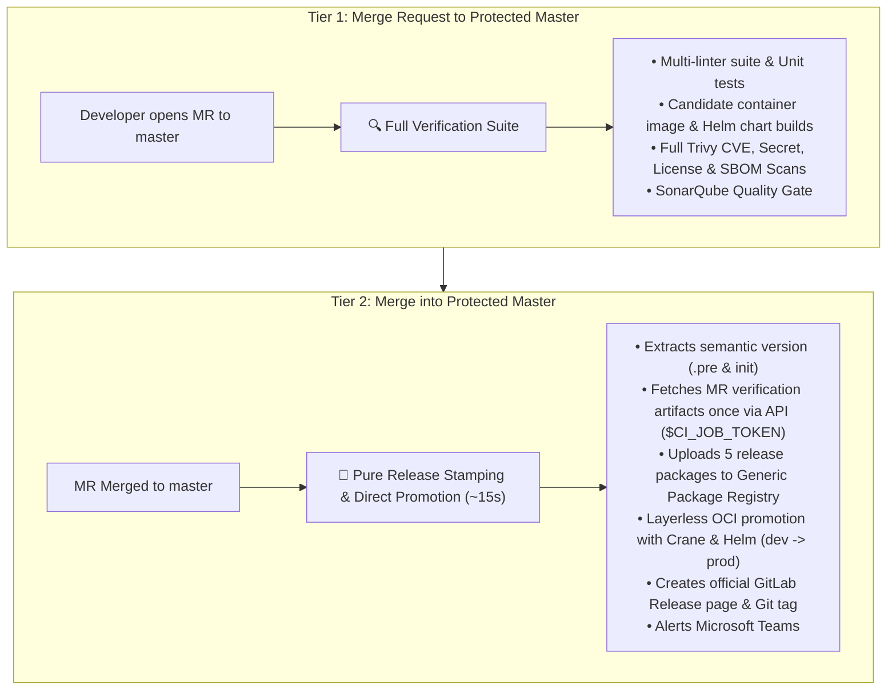

- **Silenced Feature Branches**: Direct pushes to developer branches (`dev`, `feature/*`) and MRs between non-master branches produce **0 pipelines**, eliminating wasteful runner consumption.
- **Master Branch Protection (Manual Triggers)**: If `full-pipeline`, `image-build-and-push`, or `chart-build-and-push` are manually triggered on `master` or protected `*/master` via Web UI or API, `Common:Init` automatically forces a `-rc.<pipeline_id>` suffix on all image/chart versions and routes to the **dev registry** (`IMAGE_DEV_REPOSITORY_SUFFIX`). This prevents accidental overwrite of stable production artifacts.
- **Dual Deployment Integration**:
  - **`WORKFLOW: full-pipeline`**: Deployment jobs (`Deploy:Komodo:<env>` and `Deploy:ArgoCD:<env>`) appear directly in `stage: deploy` with manual 1-click play buttons (`when: manual`, `allow_failure: true`) that automatically pick up `APP_PUSH_VERSION` / `CHART_PUSH_VERSION` / `TAG` from `Common:Init`.
  - **`WORKFLOW: deploy`**: Targeted on-demand deploy running automatically (`when: on_success`) for the specified `$DEPLOY_TARGET` after validating inputs in `stage: .pre` and verifying existing images/charts in `stage: check`.
- **All upstream `needs:` dependencies** are configured with `optional: true` so single-focus workflows run independently without waiting on skipped stages.

---

### Available Manual Workflows (`WORKFLOW`)

Triggered on demand via GitLab **Web UI (Run pipeline)** or **API triggers** using the `WORKFLOW` variable:

| `WORKFLOW` Value | Dynamic Pipeline Title | Description | Key Inputs |
|---|---|---|---|
| `full-pipeline` *(default)* | `▶️ Manual Full Pipeline Run` | Runs the complete end-to-end build, test, scan, package, push, and deploy/release flow. | `TARGET_VERSION` *(optional)* |
| `build` | `▶️ Build & Unit Test Verification` | Fast-track verification: resolves version, downloads dependencies, builds project, and executes unit tests without packaging images/charts. | — |
| `check` | `▶️ Release Prerequisites & Conflict Check` | Standalone pre-flight guard: validates git tag availability, image tag, chart version in registry, chart docs, and dependencies without building. | — |
| `deploy` | `▶️ Deploy to <TARGET>` | Triggers targeted GitOps deployment to a specified platform & environment without building. | `DEPLOY_TARGET` *(required)*, `TARGET_VERSION` *(optional)* |
| `image-build-and-push` | `▶️ Container Image Build & Push` | Builds Dockerfile/Buildah, publishes image tags to registry, and runs CVE scan. | `TARGET_VERSION` *(optional)* |
| `image-scan` | `▶️ Container Image Vulnerability Scan` | Authenticates and scans an existing remote image tag (stable `x.y.z` from prod, pre-release from dev). | `TARGET_VERSION` *(required)* |
| `chart-build-and-push` | `▶️ Helm Chart Package & Push` | Runs `helm lint`, packages the chart, publishes it to the **GitLab Helm Package Registry** (`dev` channel for RC builds, `stable` for releases), and runs a config scan. Values linting and dependency checks are **excluded** — use `lint` / `check` for those. | `TARGET_VERSION` *(optional)* |
| `chart-scan` | `▶️ Helm Chart Security & Config Scan` | Renders templates and scans local chart files (or a remote chart pulled from the GitLab Helm Package Registry if `TARGET_VERSION` is specified). | `TARGET_VERSION` *(optional)*, `HELM_TEST_VALUES` *(optional)* |
| `license-scanning` | `▶️ License Compliance Scan` | Audits local repository dependencies against open-source license compliance rules (always local). | — |
| `sbom-scanning` | `▶️ SBOM Generation & Security Scan` | Generates CycloneDX `sbom.cdx.json` from local repository and scans component packages for CVEs. | `SBOM_FILE` *(optional)* |
| `secret-scanning` | `▶️ Secret Scanning Security Audit` | Scans entire git history with Betterleaks for exposed API keys, secrets, and credentials (always local). | — |
| `sonarqube` | `▶️ SonarQube Code Quality Scan` | Runs `sonar-scanner` and checks quality gate metrics against SonarQube server. | — |
| `lint` | `▶️ Code & Config Linting` | Executes language linters (Biome, Ruff, Hadolint, yamllint, etc.) on local workspace. | — |

---

### Comprehensive Execution Matrix

| # | Workflow / Trigger Mode | Trigger Source | Automatic? | Stage Count | Job Count | Scope & Primary Purpose |
|---|---|---|:---:|:---:|:---:|---|
| **1** | **MR to Protected Master** | `merge_request_event` to `master` / `*/master` (protected) | ✅ **Yes** | 10 | 27 | **Full Verification Suite**: Linters, unit tests, candidate container image & chart builds, CVE security scans, and SonarQube quality gate. |
| **2** | **Production Release (Multi-Master)** | `push` / merge to `default_branch` (`master`) or protected `*/master` | ✅ **Yes** | 4 | 5 | **Lightweight Release Tagging & OCI Promotion**: Stamped on merge (~15s). Restores verification artifacts from MR, promotes candidate image/chart to prod via Crane & Helm, creates GitLab release, stamps Git tag, and alerts Teams. Zero builds/tests/scans. |
| **3** | **Branch Push & Non-Master MR** | `push` to `dev` / `feature/*` or MR to `dev` | ❌ **No** | 0 | 0 | **Silenced / No Pipeline**: Prevents wasteful runner minute consumption on developer branch commits. |
| **4** | **Deploy (Komodo / ArgoCD)** | `web` / `api` (`WORKFLOW: deploy`) | 🔘 **Manual** | 3 | 3 | **Targeted GitOps Deployment**: Validates target in `.pre`, verifies image/chart existence in `check`, and deploys directly without rebuilding. |
| **5** | **Container Image Scan** | `web` / `api` (`WORKFLOW: image-scan`) | 🔘 **Manual** | 3 | 3 | **Remote Image Scan**: Validates `TARGET_VERSION` in `.pre`, checks existence in registry (`check`), and executes Trivy scan (`security`). |
| **6** | **Helm Chart Scan** | `web` / `api` (`WORKFLOW: chart-scan`) | 🔘 **Manual** | 3 | 3 | **Helm Security Scan**: Validates chart target in `.pre`, checks existence (`check`), renders templates, and runs Trivy scan (`security`). |
| **7** | **Git Secret Scan** | `web` / `api` (`WORKFLOW: secret-scanning`) | 🔘 **Manual** | 1 | 1 | **Secret Audit**: Scans full git commit history for credentials and leaked tokens (isolated, zero `.pre` / `init` overhead). |
| **8** | **License Compliance Scan** | `web` / `api` (`WORKFLOW: license-scanning`) | 🔘 **Manual** | 1 | 1 | **Open Source Audit**: Validates dependency licenses against compliance policies (isolated, zero `.pre` / `init` overhead). |
| **9** | **SBOM Generation & Scan** | `web` / `api` (`WORKFLOW: sbom-scanning`) | 🔘 **Manual** | 2 | 2 | **SBOM Audit**: Generates CycloneDX SBOM and scans component inventory for vulnerabilities (isolated, zero `.pre` / `init` overhead). |
| **10** | **SonarQube Analysis** | `web` / `api` (`WORKFLOW: sonarqube`) | 🔘 **Manual** | 1 | 1 | **Code Quality Gate**: Runs SonarScanner and checks coverage & quality gates (isolated, zero `.pre` / `init` overhead). |
| **11** | **Multi-Linter Suite** | `web` / `api` (`WORKFLOW: lint`) | 🔘 **Manual** | 2 | 5 | **Unified Linting**: Executes Biome, Docker Hadolint, Helm lint, values lint, and changelog linters (isolated, zero `.pre` / `init` overhead). |
| **12** | **Image Build & Push** | `web` / `api` (`WORKFLOW: image-build-and-push`) | 🔘 **Manual** | 7 | 8 | **Isolated Image Pipeline**: Builds container image, executes unit tests, scans, and pushes to registry. |
| **13** | **Chart Build & Push** | `web` / `api` (`WORKFLOW: chart-build-and-push`) | 🔘 **Manual** | 7 | 8 | **Isolated Chart Pipeline**: Runs `helm lint`, packages the chart, scans it, and publishes to the GitLab Helm Package Registry. Jobs: `Common:Init`, `Trivy:Cache:Warm`, `Chart:Lint`, `Chart:Check Existence`, `Chart:Check:README`, `Chart:Build`, `Chart:Push`, `Chart:Scan`. |
| **14** | **Manual Full Pipeline** | `web` / `api` (`WORKFLOW: full-pipeline`) | 🔘 **Manual** | 10 | 26+ | **Manual End-to-End Run**: Full pipeline executed on demand with 1-click manual deploy buttons (`when: manual`) for instant GitOps deployment. |
| **15** | **Build & Unit Test** | `web` / `api` (`WORKFLOW: build`) | 🔘 **Manual** | 5 | 5 | **Isolated Build**: Version resolution, dependency installation, project build, and unit tests without container/chart builds. |
| **16** | **Release Prerequisites Check** | `web` / `api` (`WORKFLOW: check`) | 🔘 **Manual** | 3 | 7 | **Pre-flight Release Verification**: Verifies tag, remote image, remote chart, README sync, and dependency rules. |

---

## End-to-End Workflow DAGs & Architecture

### 1. Automatic Merge Request Verification (`🔍 MR Verification`)

> **Trigger:** Merge Request targeting protected `master` or protected `*/master`.  
> **Purpose:** Verifies 100% of code quality, unit tests, container builds, Helm packaging, CVE scans, and SonarQube quality gates prior to merging.

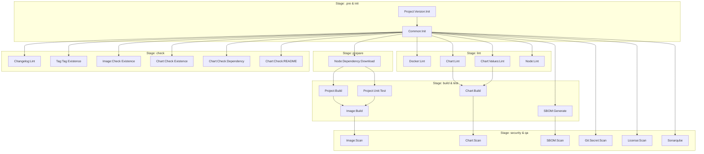

---

### 2. Fast-Track Production Release Tagging & OCI Promotion (`🚀 Production Release`)

> **Trigger:** Merge Request merged into `default_branch` (`master`) or protected `*/master`.  
> **Philosophy:** Pure lightweight release stamping (~15 seconds) with zero redundant compilation, unit testing, or re-scanning.  
> **Candidate Resolution & Direct Promotion:**
> 1. `Common:Init` on `master` queries GitLab API (`/projects/:id/repository/commits/:sha/merge_requests`) to discover the upstream MR and its latest successful verification pipeline `#<UPSTREAM_PIPELINE_ID>`.
> 2. It exports the exact pre-built dev candidate version: `DEV_CANDIDATE_VERSION="${RELEASE_VERSION}-rc.${UPSTREAM_PIPELINE_ID}-${MR_IID}"`.
> 3. `Image:Promote` uses **Crane** for layerless OCI promotion: pulls the candidate manifest directly from `registry.contoso.com/acme/<project>/dev:<DEV_CANDIDATE_VERSION>`, mutates the version label to `${TAG}`, and pushes to `registry.contoso.com/acme/<project>:${TAG}` along with `latest`, `${MAJOR_VERSION}`, and `${MINOR_VERSION}` tags.
> 4. `Chart:Promote` pulls the candidate chart from the GitLab Helm Package Registry `dev` channel (`<chart>:${DEV_CANDIDATE_CHART_VERSION}`), re-packages with production `${TAG}`, and publishes it to the `stable` channel.
> 5. `Release:Upload` restores verification artifacts from the upstream MR pipeline once using `$CI_JOB_TOKEN` and publishes release assets to the Generic Package Registry.
> 6. `Release` creates the official GitLab Release page and Git tag `${TAG}`.
> 7. `Release:Notification:Teams` sends an Adaptive Card release summary to Microsoft Teams.

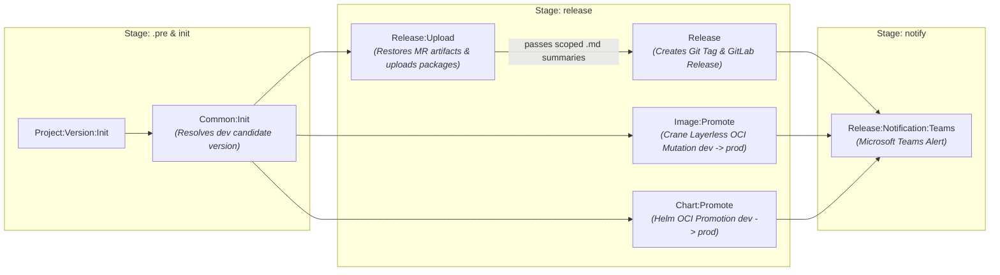

---

### 3. GitOps Targeted Deployment (`WORKFLOW: deploy`)

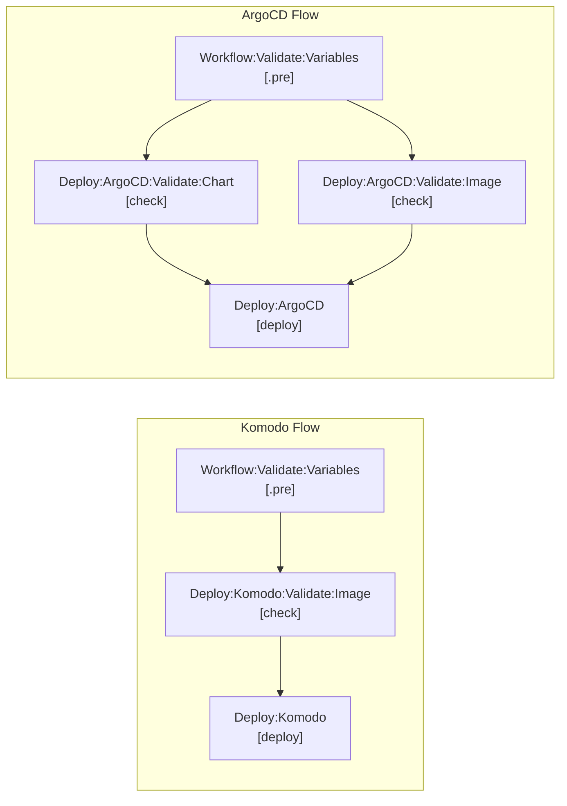

---

### 4. Standalone Quality & Security Audits

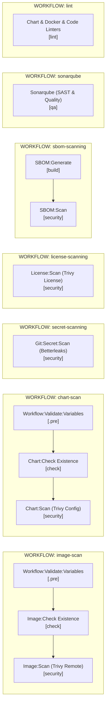

---

## Module Catalog

### common

The core backbone included in all pipelines. Computes semantic versions, manages `init.env`, and provides standard rule anchors and Trivy scanner scripts.

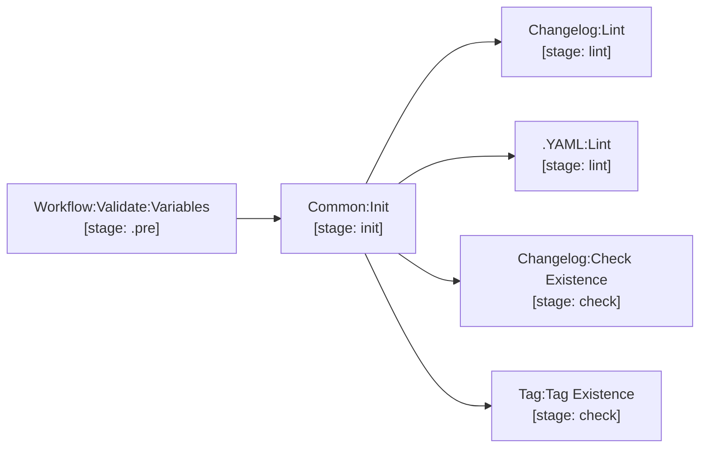

| Job / Template | Stage | Description |
|---|---|---|
| `Common:Init` | `init` | Calculates `RELEASE_VERSION`, `APP_PUSH_VERSION`, `TAG`, `MAJOR_VERSION`, `MINOR_VERSION`, `CHART_NAME`, `CHART_PUSH_VERSION`. Exports `init.env`. |
| `Changelog:Lint` | `lint` | Validates keepachangelog format in `CHANGELOG.md`. |
| `Changelog:Check Existence` | `check` | Ensures `CHANGELOG.md` contains an entry for the version being released. |
| `Tag:Tag Existence` | `check` | Fails if the git tag already exists in the repository. |
| `Workflow:Validate:Variables` | `.pre` | Validates required inputs during manual `deploy` (checks `DEPLOY_TARGET`), `image-scan` (checks `TARGET_VERSION`), and `chart-scan` (checks local or remote chart). |
| `.scan-script` | — | Base Trivy scanning engine supporting image, config, license, and SBOM scanners. |
| `.MD:Lint` | `lint` | Reusable Markdownlint template for `LINT_MD_FILES`. |
| `.YAML:Lint` | `lint` | Reusable yamllint template for `LINT_YAML_FILES`. |

---

### nodejs

Full lifecycle support for Node.js / TypeScript / Frontend / Backend applications using npm and Biome.

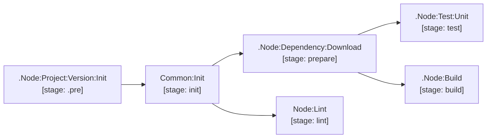

| Job / Template | Type | Stage | Description |
|---|---|---|---|
| `.Node:24` | Template | — | Node.js 24 base image + `.npm` caching configuration. |
| `.Node:Project:Version:Init` | Template | `.pre` | Reads `.version` from `package.json` and writes `version.env`. |
| `.Node:Dependency:Download` | Template | `prepare` | Runs `npm ci --include=dev` into the `.npm` cache. |
| `.Node:Build` | Template | `build` | Standard build template with pull cache and dependencies on `Common:Init` and `Node:Dependency:Download`. |
| `Node:Lint` | Job | `lint` | Runs `biome check` against `biome.json`. |
| `.Node:Test:Unit` | Template | `test` | Base unit test job with JUnit artifact collection and pull cache. |

---

### python

Python service lifecycle management powered by `uv`, Ruff, and MyPy.

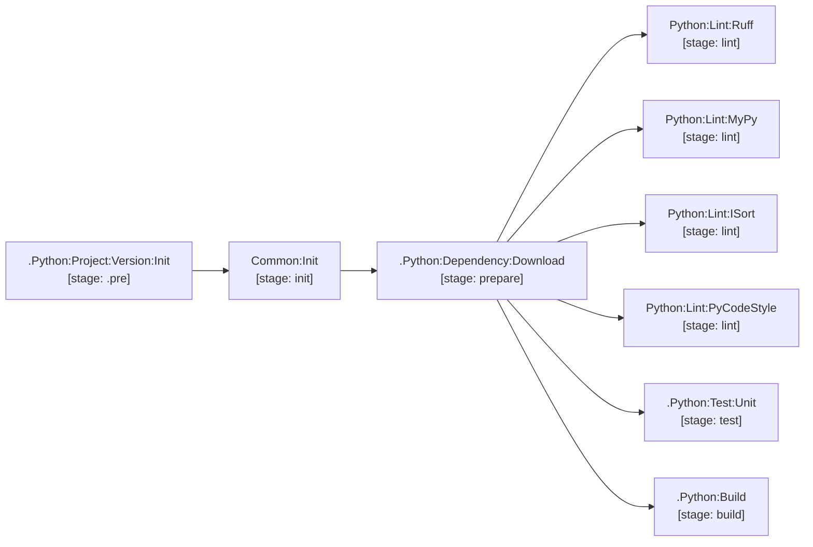

| Job / Template | Type | Stage | Description |
|---|---|---|---|
| `.Python:12` | Template | — | Python 3.12 runtime base image + `.uv` cache. |
| `.Python:Project:Version:Init` | Template | `.pre` | Extracts version from `pyproject.toml`. |
| `.Python:Dependency:Download` | Template | `prepare` | Warms `.uv` cache via `uv sync --frozen --no-install-project --no-install-workspace`. |
| `.Python:Build` | Template | `build` | Compiles wheel/sdist archives to `dist/` via `uv build --offline`. |
| `Python:Lint:Ruff` | Job | `lint` | Ruff linting. |
| `Python:Lint:MyPy` | Job | `lint` | Static type checking. |
| `Python:Lint:ISort` | Job | `lint` | Import order formatting validation. |
| `Python:Lint:PyCodeStyle` | Job | `lint` | PEP8 code style enforcement. |
| `.Python:Test:Unit` | Template | `test` | Unit test execution base with JUnit report collection. |

---

### golang

Go microservice and CLI pipeline with automated formatting, vet directives, and security scanning.

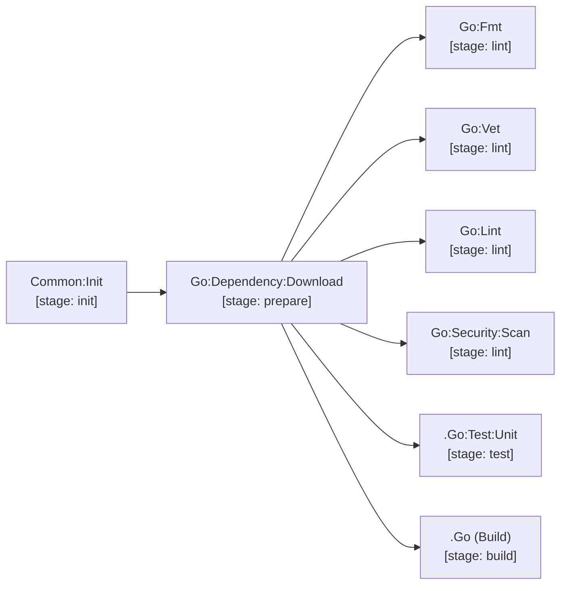

| Job / Template | Type | Stage | Description |
|---|---|---|---|
| `Go:Dependency:Download` | Job | `prepare` | Warms Go module cache via `go mod download`. |
| `Go:Fmt` | Job | `lint` | Enforces `go fmt` compliance. |
| `Go:Vet` | Job | `lint` | Runs `go vet` with `// govet:ignore` suppression support. |
| `Go:Lint` | Job | `lint` | Comprehensive linting with `golangci-lint`. |
| `Go:Security:Scan` | Job | `lint` | Static security audit with `gosec`. |
| `.Go` | Template | `build` | Go build base image + cache configuration. |
| `.Go:Test:Unit` | Template | `test` | Unit test runner with JUnit conversion. |

---

### java

Java / Maven lifecycle support for Java 25 microservices.

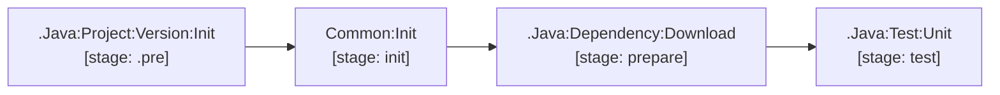

| Job / Template | Type | Stage | Description |
|---|---|---|---|
| `.Java:25` | Template | — | Java 25 runtime image + `.m2` local repository cache. |
| `.Java:Project:Version:Init` | Template | `.pre` | Extracts `project.version` from `pom.xml`. |
| `.Java:Dependency:Download` | Template | `prepare` | Runs `mvn dependency:go-offline`. |
| `.Java:Test:Unit` | Template | `test` | Maven test runner with Surefire XML report collection. |

---

### image

Container image building and registry management supporting both Docker and Buildah.

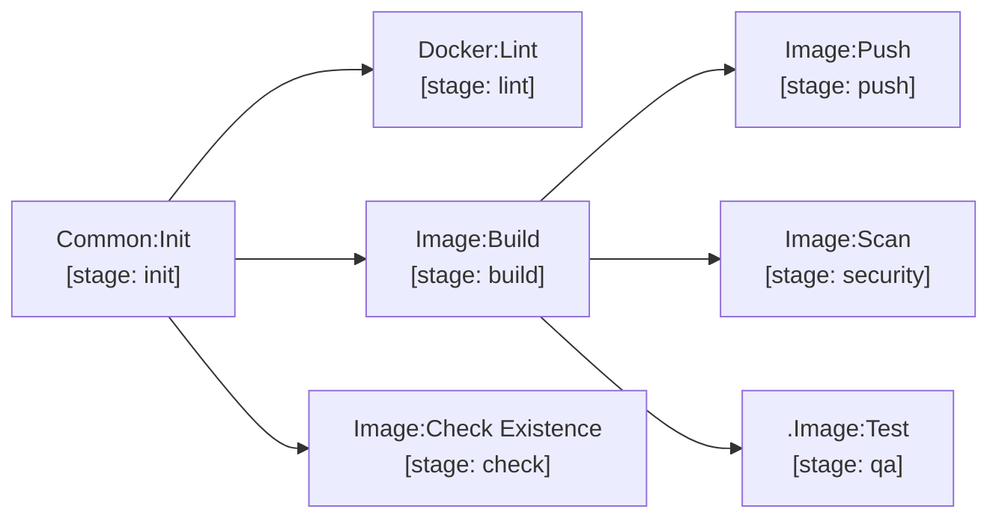

| Job / Template | Stage | Description |
|---|---|---|
| `Docker:Lint` | `lint` | Hadolint Dockerfile linting with configurable ignores. |
| `Image:Build` | `build` | Docker/BuildKit build with build-args injection and registry cache. Saves image tar artifact. |
| `Image:Check Existence` | `check` | Verifies image tag does not already exist in registry before release. |
| `Image:Push` | `push` | Publishes image to registry. Automatically tags `latest`, `MAJOR`, and `MINOR` on production release. |
| `Image:Scan` | `security` | Trivy CVE scan on local image tar (or pulls remote image in `image-scan` workflow). |
| `.Image:Test` | `qa` | Runs `ci_image_test.sh` **inside the built image** before it is scanned or pushed. Opt-in: extend it only where the image has a contract worth asserting — entrypoint on `PATH`, `EXPOSE` port listening, process running as `10001`. GitHub's equivalent is `docker.yml` `test: true`. |

#### Dockerfile Standards & Multi-Stack Reference (Packaging-Only & Non-Root 10001:10001)

Every container image built by this platform adheres strictly to the **Packaging-Only Standard** and **Non-Root Runtime Enforcement**:

1. **Packaging-Only Standard (Zero Compilation in Dockerfile)**:
   - All compiling, bundling, transpile steps (`npm run build`, `mvn package`, `go build`, `uv build`), linting, and tests **MUST** execute strictly in GitLab CI stages (`prepare`, `build`, `test`).
   - The `Dockerfile` serves purely as an artifact packaging manifest. It copies pre-built artifacts emitted by `Project:Build`.
   - Where an interpreted stack must install dependencies, it installs **offline** from the CI package cache, bind-mounted by BuildKit — never resolving over the network, which would re-resolve what the pipeline already pinned and scanned. The `--mount` source must name the directory the pipeline actually cached (`.uv`, `.npm`), and `.dockerignore` must admit it.
2. **Non-Root User & Group (10001:10001)**:
   - For security compliance, containers must never execute as `root` (UID `0`).
   - Every Dockerfile declares `USER 10001:10001`.
   - All copied application files and artifacts must be owned by the non-root user using `COPY --chown=10001:10001 ...`.
   - If the application writes logs, cache, or PID files at runtime, ensure the target directories exist and are owned by `10001:10001` before the `USER` directive.
   - Non-privileged listening port: standard application port is `EXPOSE 8080`.
3. **Automatic CI Build-Arg Base Images**:
   The `image/.docker.gitlab-ci.yml` builder automatically resolves and injects the following build-args into `docker build`. A Dockerfile pins nothing itself — bumping a base image is a change to one CI/CD variable pair in `common/.gitlab-ci.yml`.

| Tech Stack | Injected CI Build-Arg | Variable pair | Current default |
|---|---|---|---|
| **Java** | `JAVA_25_MICRO_BASE_IMAGE` | `JAVA_25_MICRO_BASE_IMAGE_REPO` / `_TAG` | `registry-1.docker.io/grootantech/java-25:1.0.0` |
| **Golang** | `MICRO_ROOT_BASE_IMAGE` | `MICRO_ROOT_BASE_IMAGE_REPO` / `_TAG` | `registry-1.docker.io/grootantech/micro-root:1.0.0` |
| **Python** | `PYTHON_312_MICRO_BASE_IMAGE` | `PYTHON_312_MICRO_BASE_IMAGE_REPO` / `_TAG` | `registry-1.docker.io/grootantech/python-3-12:1.0.0` |
| **Node.js Backend** | `NODE_JS_24_MICRO_BASE_IMAGE` | `NODE_JS_24_MICRO_BASE_IMAGE_REPO` / `_TAG` | `registry-1.docker.io/grootantech/node-24:1.0.0` |
| **Node.js Frontend** | `NGINX_MICRO_BASE_IMAGE` | `NGINX_MICRO_BASE_IMAGE_REPO` / `_TAG` | `registry-1.docker.io/grootantech/micro-nginx:1.0.0` |
| **Multi-stage builder** | `TOOLKIT_BUILD_IMAGE` | `TOOLKIT_BUILD_IMAGE_REPO` / `_TAG` | `registry-1.docker.io/grootantech/toolkit:verify-v2` |
| **All** | `VERSION` | — | `${APP_PUSH_VERSION}` |

   GitLab additionally injects `CI_DEPENDENCY_PROXY_GROUP_IMAGE_PREFIX` (with a trailing `/`), so a public base image is written `FROM ${CI_DEPENDENCY_PROXY_GROUP_IMAGE_PREFIX}redhat/ubi9-minimal:${TAG}` with no separator. **GitHub has no Dependency Proxy and injects no equivalent** — a Dockerfile shared between the two platforms must give that ARG a default.

4. **Base image selection**:
   Use the runtime image matching the project language; fall back to `MICRO_ROOT_BASE_IMAGE` when no language image fits. **A runtime stage is never built `FROM` a build image.** A `*_BUILD_IMAGE` carries compilers, package managers and credential helpers, all of which would ship to production — it belongs in a builder stage only.

5. **Tags are pinned, never floating**:
   No `:latest`, and no untagged reference. A literal image carries an explicit tag with a `# renovate:` annotation on the line above so the bot can bump it. A `FROM ${VAR}` reference needs no tag: CI resolves it from the variable pair above.

6. **Runtime instructions**:
   - `EXPOSE` is required on a service image. It is the image's only self-describing contract, and the chart's `containerPort` is unverifiable without it.
   - **Prefer `CMD`.** It states the default command while leaving an operator free to override it with `docker run <image> <cmd>`.
   - Use `ENTRYPOINT` only to invoke a pre-start shim — a script that must substitute configuration before the service starts. If that shim `exec`s the service as its last action it becomes PID 1 and needs nothing further. If it forks, or leaves children running, `exec` through `dumb-init` so signals and zombie reaping work: `exec /usr/bin/dumb-init -- nginx -g "daemon off;"`.

7. **Layout: the `USER` bracket, grouping and layers**:
   - `USER 0` immediately after the runtime stage's `FROM`, opening the root setup phase. `USER 10001:10001` closes it, before the runtime instructions. A builder stage is discarded and needs no `USER 0` — declaring one there trips hadolint `DL3002` ("last USER should not be root"), which is evaluated per stage and gates `Docker:Lint`.
   - Group by instruction kind and separate groups with one blank line. Instructions that form a single unit — a run of `COPY`s, one install-and-chown `RUN` — stay together with no blank line between them, under one comment saying what the group is for.
   - **Merge consecutive `RUN`s.** Each one is a layer, and a layer keeps whatever the previous one left behind. Chain with `&& \` instead.
   - Group related `ARG`s into one continued statement. The exception is a version pin: an `ARG` carrying a `# renovate:` annotation stays on its own line, because the annotation binds to the line below it.
   - Copy source **after** the dependency install, never before, or every source edit invalidates the dependency layer.

---

##### 1. Java / Spring Boot Microservice

- **Base Image**: `${JAVA_25_MICRO_BASE_IMAGE}`
- **Build Artifacts Copied**: Pre-built executable fat JAR from `target/*.jar` (Maven) or `build/libs/*.jar` (Gradle).
- **File Ownership & Permissions**: `COPY --chown=10001:10001 target/*.jar /app/app.jar`
- **JVM Container Options**: Configured with `-XX:+UseContainerSupport` and `-XX:MaxRAMPercentage=75.0` for dynamic cgroup memory limits.

```dockerfile
ARG JAVA_25_MICRO_BASE_IMAGE
FROM ${JAVA_25_MICRO_BASE_IMAGE}

USER 0

WORKDIR /app

# Copy pre-compiled executable JAR from CI Project:Build stage with non-root ownership
COPY --chown=10001:10001 target/*.jar /app/app.jar

USER 10001:10001
EXPOSE 8080

CMD ["java", "-XX:+UseContainerSupport", "-XX:MaxRAMPercentage=75.0", "-jar", "/app/app.jar"]
```

```dockerignore
# .dockerignore (Inverted Allowlist)
**
*

!target/*.jar
!build/libs/*.jar
```

---

##### 2. Golang Microservice (Static Binary)

- **Base Image**: `${MICRO_ROOT_BASE_IMAGE}` (distroless minimal root container).
- **Build Artifacts Copied**: Statically compiled binary built in CI (`CGO_ENABLED=0 go build -ldflags="-s -w" -o bin/api-service .`).
- **File Ownership & Permissions**: `COPY --chown=10001:10001 bin/api-service /app/api-service`
- **Executable Permissions**: `chmod +x` is set during `Project:Build` stage before packaging.

```dockerfile
ARG MICRO_ROOT_BASE_IMAGE
FROM ${MICRO_ROOT_BASE_IMAGE}

USER 0

WORKDIR /app

# Copy statically linked binary from CI Project:Build stage with non-root ownership
COPY --chown=10001:10001 bin/api-service /app/api-service

USER 10001:10001
EXPOSE 8080

CMD ["/app/api-service"]
```

```dockerignore
# .dockerignore (Inverted Allowlist)
**
*

!bin/
!bin/*
```

---

##### 3. Python Microservice (FastAPI / Flask / Worker with `uv`)

- **Base Image**: `${PYTHON_312_MICRO_BASE_IMAGE}`
- **Storage Strategy**: **Pattern A (Cache-Only with BuildKit Bind Mount)** — Zero bytes of dependencies in GitLab coordinator artifact storage. `Image:Build` pulls the `.uv` cache directly from Runner Cache, and `Project:Build` exports only lightweight package archives (`dist/`, ~8 KB).
- **BuildKit Bind Mount**: The `.uv` cache folder is mounted temporarily via `--mount=type=bind,source=.uv,target=/tmp/.uv`. It is **never copied** into the image filesystem, ensuring zero layer bloat.
- **Environment**: `ENV PATH="/app/.venv/bin:$PATH"` (`PYTHONUNBUFFERED=1` is pre-configured in the base image).
- **File Ownership & Permissions**: `COPY --chown=10001:10001 ...` and `chown -R 10001:10001 /app`
- **Zero Internet Access**: `uv sync` installs strictly offline from the mounted `/tmp/.uv` in milliseconds.

```dockerfile
ARG PYTHON_312_MICRO_BASE_IMAGE
FROM ${PYTHON_312_MICRO_BASE_IMAGE}

USER 0

WORKDIR /app
ENV PATH="/app/.venv/bin:$PATH"

# Copy locked dependency manifests
COPY --chown=10001:10001 pyproject.toml uv.lock ./

# Mount pre-warmed CI cache via Buildx, install production dependencies offline, set ownership
RUN --mount=type=bind,source=.uv,target=/tmp/.uv \
    uv sync --frozen --no-dev --no-install-project --no-install-workspace --offline --cache-dir /tmp/.uv && \
    chown -R 10001:10001 /app

# Copy application source code with non-root ownership
COPY --chown=10001:10001 src/ /app/src/

USER 10001:10001
EXPOSE 8080

CMD ["uvicorn", "src.main:app", "--host", "0.0.0.0", "--port", "8080"]
```

```dockerignore
# .dockerignore (Inverted Allowlist)
**
*

# Dependency manifests
!pyproject.toml
!uv.lock

# CI cache for BuildKit bind mount
!.uv
!.uv/**

# Application source code
!src
!src/**
```

---

##### 4. Node.js Backend (NestJS, Strapi, Express)

- **Base Image**: `${NODE_JS_24_MICRO_BASE_IMAGE}`
- **Build Artifacts Copied**: Pre-compiled TypeScript output (`dist/`) and `package*.json`. Production dependencies are installed **offline in the image** from the `.npm` cache `Dependency:Download` warmed — `node_modules/` is cached, never artifacted.
- **File Ownership & Permissions**: `COPY --chown=10001:10001 ...`
- **Runtime Environment**: `ENV NODE_ENV=production PORT=8080`

```dockerfile
ARG NODE_JS_24_MICRO_BASE_IMAGE
FROM ${NODE_JS_24_MICRO_BASE_IMAGE}

USER 0

WORKDIR /app
ENV NODE_ENV=production \
    PORT=8080

# Copy locked dependency manifests
COPY --chown=10001:10001 package*.json /app/

# Mount the pre-warmed CI cache via Buildx, install production dependencies offline,
# and set ownership
RUN --mount=type=bind,source=.npm,target=/tmp/.npm,rw \
    npm ci --omit=dev --offline --no-audit --no-fund --cache /tmp/.npm && \
    chown -R 10001:10001 /app

# Copy pre-compiled dist/ with non-root ownership
COPY --chown=10001:10001 dist/ /app/dist/

USER 10001:10001
EXPOSE 8080

CMD ["node", "dist/main.js"]
```

```dockerignore
# .dockerignore (Inverted Allowlist)
**
*

!package*.json
!.npm
!.npm/**
!dist/
!dist/**
```

---

##### 5. Node.js Frontend SPA (React, Vue, Angular, Vite with Nginx)

- **Base Image**: `${NGINX_MICRO_BASE_IMAGE}`
- **Build Artifacts Copied**:
  1. Static HTML/JS/CSS distribution bundle: `dist/` or `build/`
  2. SPA reverse proxy configuration: `nginx.conf`
- **Nginx Non-Root Operation**:
  - `micro-nginx` base image is pre-configured for unprivileged non-root operation:
    - Listens on non-root port `8080`.
    - PID stored in `/tmp/nginx.pid`.
    - Temporary cache paths pre-configured in `/tmp/client_temp`, `/tmp/proxy_temp`.
    - Client-side router support via `try_files $uri $uri/ /index.html;`.
- **File Ownership & Permissions**: `COPY --chown=10001:10001 ...`

```dockerfile
ARG NGINX_MICRO_BASE_IMAGE
FROM ${NGINX_MICRO_BASE_IMAGE}

USER 0

# Copy pre-compiled static distribution and SPA nginx configuration with non-root ownership
COPY --chown=10001:10001 dist/ /usr/share/nginx/html/
COPY --chown=10001:10001 nginx.conf /etc/nginx/conf.d/default.conf

USER 10001:10001
EXPOSE 8080

CMD ["nginx", "-g", "daemon off;"]
```

```dockerignore
# .dockerignore (Inverted Allowlist)
**
*

!dist/
!dist/**
!build/
!build/**
!nginx.conf
```

---

##### 6. Multi-Stage (only when the pipeline cannot produce the artifact)

Most images need no builder stage: `Project:Build` produces the artifact and the Dockerfile
copies it. Where a builder stage is genuinely needed, it uses `${TOOLKIT_BUILD_IMAGE}` and
the runtime stage copies out of it — the runtime stage itself is always a micro base image.

- **Builder Stage**: `${TOOLKIT_BUILD_IMAGE}`, discarded after the build. No `USER 0` here — hadolint `DL3002` is evaluated per stage.
- **Runtime Stage**: the language micro base image, or `${MICRO_ROOT_BASE_IMAGE}` as fallback.
- **File Ownership & Permissions**: `COPY --from=builder --chown=10001:10001 ...`

```dockerfile
ARG TOOLKIT_BUILD_IMAGE \
    MICRO_ROOT_BASE_IMAGE

FROM ${TOOLKIT_BUILD_IMAGE} AS builder

WORKDIR /src

COPY . .

RUN make build

FROM ${MICRO_ROOT_BASE_IMAGE}

USER 0

WORKDIR /app

# Copy only the built artifact out of the builder stage
COPY --from=builder --chown=10001:10001 /src/bin/app /app/app

USER 10001:10001

EXPOSE 8080

CMD ["/app/app"]
```

---

#### The Inverted `.dockerignore` Allowlist Standard (Default Deny)

To enforce strict packaging hygiene, minimize Docker build context transfer to under 100 KB, and guarantee that zero sensitive local files (`.git/`, `.env`, secrets, test caches, local virtual environments) leak into image builds, all projects must employ an **Inverted Allowlist `.dockerignore`**:

1. **Default Deny**: Block everything recursively by placing `**` and `*` at the top of the file.
2. **Explicit Allowlist (`!`)**: Strictly unignore only the exact files, build output, or manifests required by that specific stack's `Dockerfile`.

##### Stack-by-Stack `.dockerignore` Reference

| Tech Stack | Allowlisted Packaging Targets | Sample `.dockerignore` |
|---|---|---|
| **Python** (`uv` + `src/` layout) | `pyproject.toml`, `uv.lock`, `.uv/`, `src/` | `**`<br/>`*`<br/>`!pyproject.toml`<br/>`!uv.lock`<br/>`!.uv`<br/>`!.uv/**`<br/>`!src`<br/>`!src/**` |
| **Java** (Spring Boot Fat JAR) | Maven (`target/*.jar`) or Gradle (`build/libs/*.jar`) | `**`<br/>`*`<br/>`!target/*.jar`<br/>`!build/libs/*.jar` |
| **Golang** (Static Binary) | Pre-compiled binary (`bin/`) | `**`<br/>`*`<br/>`!bin/`<br/>`!bin/*` |
| **Node.js Frontend** (Nginx SPA) | Static bundle (`dist/`), `nginx.conf` | `**`<br/>`*`<br/>`!dist/`<br/>`!dist/**`<br/>`!nginx.conf` |
| **Node.js Backend** (Express / NestJS) | `dist/`, `.npm` cache, `package*.json` | `**`<br/>`*`<br/>`!dist/`<br/>`!dist/**`<br/>`!package.json`<br/>`!package-lock.json`<br/>`!.npm`<br/>`!.npm/**` |

---

### chart

Helm chart packaging via the [GitLab Helm Package Registry](https://docs.gitlab.com/user/packages/helm_repository/), plus Kubernetes manifest validation.

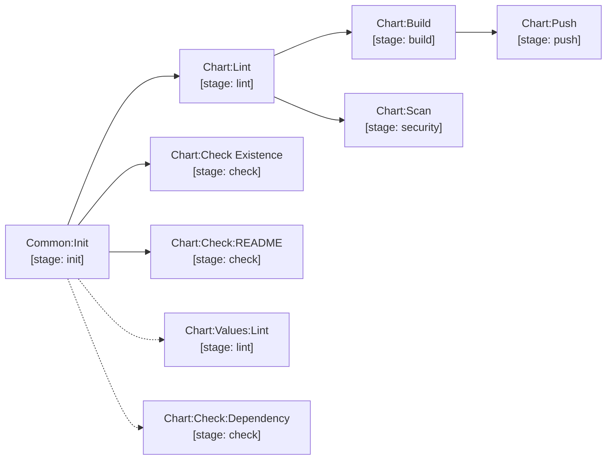

> Dotted jobs (`Chart:Values:Lint`, `Chart:Check:Dependency`) run on merge requests and under
> the `lint` / `check` / `full-pipeline` workflows, but are **excluded from `chart-build-and-push`**.

| Job | Stage | Description |
|---|---|---|
| `Chart:Lint` | `lint` | `helm lint --strict` with optional value overrides. |
| `.Chart:UnitTest` | `test` | **Optional, opt-in.** Renders a mock consumer chart at `${CHART_DIR}/${MOCK_CHART}` with `helm unittest --strict` and publishes a JUnit report. Hidden template — declare `Chart:UnitTest: {extends: .Chart:UnitTest}` to enable. For repositories that *ship* a chart others depend on; requires the `unittest` Helm plugin in the job image. |
| `Chart:Check Existence` | `check` | Checks whether the chart version already exists in the GitLab Helm Package Registry. |
| `Chart:Check:README` | `check` | Validates that `helm-docs` generated documentation is up to date. |
| `Chart:Check:Dependency` | `check` | Prevents release charts from depending on development chart repositories. *(Not run in `chart-build-and-push`.)* |
| `Chart:Values:Lint` | `lint` | Validates YAML syntax of chart values files. *(Not run in `chart-build-and-push`.)* |
| `Chart:Build` | `build` | Packages chart into `.tgz` artifact using `helm package`. |
| `Chart:Push` | `push` | Publishes the chart to the GitLab Helm Package Registry — `dev` channel for RC builds, `stable` for releases (stable also mirrors to `dev`). |
| `Chart:Scan` | `security` | Renders templates via `helm template` and runs Trivy config scan for security misconfigurations. Remote charts (`TARGET_VERSION`) are pulled from the Package Registry. |

---

### terraform

Terraform infrastructure services and reusable module verification.

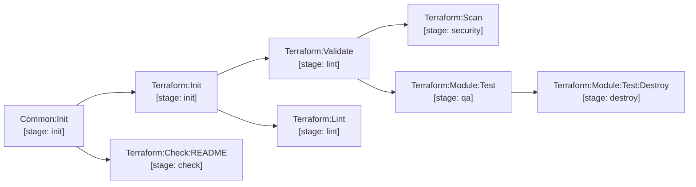

- **Service (`terraform/.gitlab-ci.yml`)**: `Terraform:Init` &rarr; `Terraform:Validate` &rarr; `Terraform:Lint` &rarr; `Terraform:Check:README` &rarr; `Terraform:Scan`.
- **Module Test (`terraform/.test.gitlab-ci.yml`)**: `Terraform:Module:Test` runs Go Terratest suites with automatic `Terraform:Module:Test:Destroy` on failure.

#### Consuming a module — no packaging step

Modules are consumed directly from git. There is no package, no registry upload and no
publish job to maintain: the git ref *is* the version.

```hcl
module "vpc" {
  source = "git::git@gitlab.contoso.com:infra/terraform-modules.git//modules/vpc?ref=1.0.0"
}

module "eks" {
  # git::<repo_url>//<sub_folder>?ref=<tag | branch | commit>
  source = "git::git@gitlab.contoso.com:infra/terraform-modules.git//modules/eks?ref=b4f8d29"
}
```

> [!IMPORTANT]
> Always pin `?ref=` to a tag or commit SHA. A branch ref (`?ref=main`) re-resolves on every
> `terraform init`, so a plan can change without the consuming repository changing.

---

### sonarqube

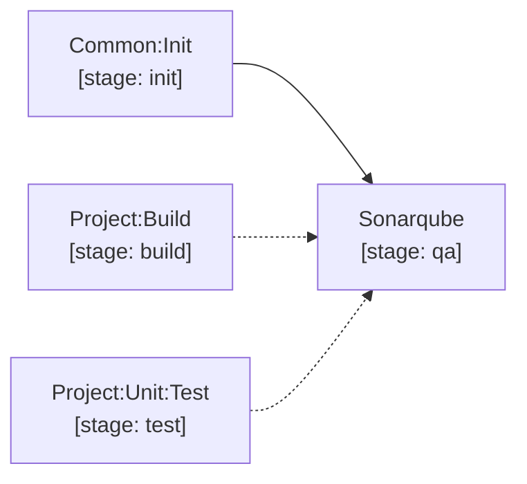

`Sonarqube` (stage `qa`): Runs `sonar-scanner` with `sonar.properties`. Automatically pulls full git history (`GIT_DEPTH: 0`), ingests coverage and unit test reports, and enforces the SonarQube Quality Gate.

---

### secret-scanning

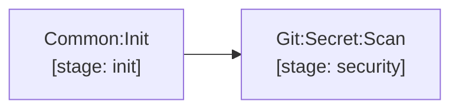

`Git:Secret:Scan` (stage `security`): Betterleaks secret detection across complete repository commit history. Detected secrets are masked from job logs.

---

### license

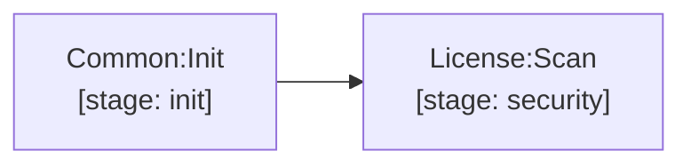

`License:Scan` (stage `security`): Single unified Trivy repository filesystem scanner (`trivy fs --scanners license --license-full .`). Checks all package dependencies against allowed license policies.

---

### sbom

CycloneDX Software Bill of Materials generation and vulnerability scanner:

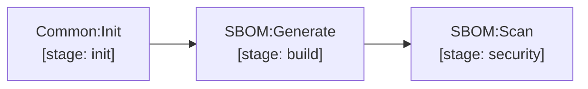

- `SBOM:Generate` (stage `build`): Generates `sbom.cdx.json`.
- `SBOM:Scan` (stage `security`): Scans SBOM components for CVEs via Trivy server.

---

### deploy/gitops

Multi-environment GitOps deployment generators for Komodo and ArgoCD using GitLab CI Component Inputs. Every deployment pipeline automatically executes mandatory pre-flight registry validation jobs in `stage: check` prior to running `stage: deploy`:

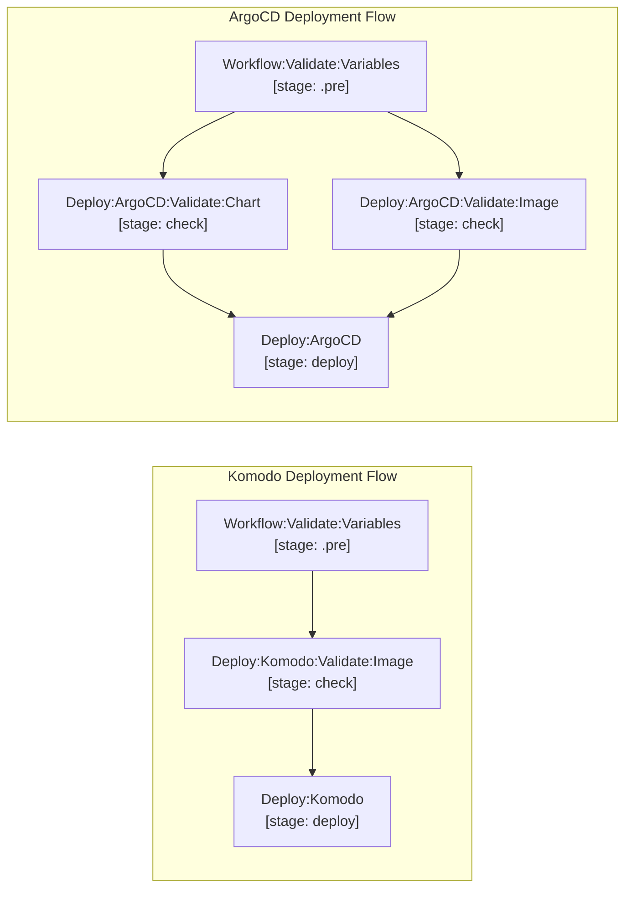

- **Komodo**: `Deploy:Komodo:Validate:Image:<env>` verifies target container image in OCI registry before `Deploy:Komodo:<env>` begins.
- **ArgoCD**: `Deploy:ArgoCD:Validate:Chart:<env>` and `Deploy:ArgoCD:Validate:Image:<env>` verify target chart and image exist in OCI registry before `Deploy:ArgoCD:<env>` commits GitOps changes and syncs ArgoCD.

#### Komodo Deployment Component (`deploy/gitops/.komodo.gitlab-ci.yml`)
Deploys container images to Komodo stacks via GitOps Docker Compose updates and triggers the Komodo API:
```yaml
include:
  - project: 'devops/library/cicd'
    ref: '1.0.0'
    file: deploy/gitops/.komodo.gitlab-ci.yml
    inputs:
      environment: staging
      gitops_repo_url: https://gitlab.contoso.com/devops/gitops/komodo.git
      gitops_branch: environments/staging
      gitops_compose_file: app/docker-compose.yml
      gitops_service_image_yq_path: .services.web.image
      komodo_stack_name: web-app-staging
      komodo_sync_timeout: 600
      environment_url: https://staging.contoso.com
```

#### ArgoCD Deployment Component (`deploy/gitops/.argocd.gitlab-ci.yml`)
Supports both **Helm-based** (App-of-Apps values) and **Manifest-based** (raw Kubernetes YAML) deployments with strict automated validation:

##### Option A: Helm-Based Deployment
```yaml
include:
  - project: 'devops/library/cicd'
    ref: '1.0.0'
    file: deploy/gitops/.argocd.gitlab-ci.yml
    inputs:
      environment: production
      gitops_repo_url: https://gitlab.contoso.com/devops/gitops/website-gitops.git
      gitops_branch: myapp/prod
      gitops_chart_values_file: values.yaml
      gitops_chart_app_yq_path: .apps.web
      argocd_apps: acme-cloud-myapp-prod-root acme-cloud-myapp-web-prod
```

##### Option B: Manifest-Based Deployment
```yaml
include:
  - project: 'devops/library/cicd'
    ref: '1.0.0'
    file: deploy/gitops/.argocd.gitlab-ci.yml
    inputs:
      environment: production
      gitops_repo_url: https://gitlab.contoso.com/devops/gitops/website-gitops.git
      gitops_branch: myapp/prod
      gitops_manifest_file: extras/manifests/clamav/deployment.yaml
      gitops_new_image: clamav/clamav:1.4.0
      argocd_apps: acme-cloud-myapp-extras-prod-clamav
```

##### Strict Parameter & Validation Rules (Hard Fail)
- **Host & Token Guards**: Pipelines immediately hard-fail if `gitops_repo_url`, `gitops_branch`, `argocd_server`/`komodo_server`, or `argocd_token`/`komodo_api_key`/`komodo_api_secret` are empty.
- **Mutual Exclusivity**: You cannot specify both `gitops_chart_values_file` and `gitops_manifest_file`.
- **Helm Mode**: If `gitops_chart_values_file` is specified, `gitops_chart_app_yq_path` is strictly mandatory. If `gitops_image_values_file` is also provided, `gitops_image_repo_yq_path` and `gitops_image_tag_yq_path` are both mandatory.
- **Manifest Mode**: If `gitops_manifest_file` is specified, `gitops_new_image` is strictly mandatory. Direct container image update occurs without container name filtering.


#### Direct GitLab Deployment Component (`deploy/gitlab/.gitlab-ci.yml`)
```yaml
include:
  - project: 'devops/library/cicd'
    ref: 1.0.0
    file: deploy/gitlab/.gitlab-ci.yml
    inputs:
      environment: production
      environment_name: production
      environment_url: https://myapp.contoso.com
      script:
        - echo "Deploying to production..."
        - ./deploy-script.sh
```

---

### release & notify (`release/.gitlab-ci.yml`)

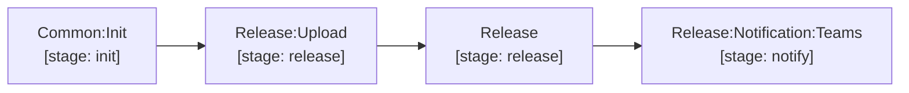

The `release/.gitlab-ci.yml` module provides the complete release lifecycle and notification dispatch:

- `Release:Upload`: Automatically fetches pre-generated verification reports and summaries from the upstream Merge Request pipeline via GitLab API (`$CI_JOB_TOKEN`), packages and uploads release assets (`*_${TRIVY_SCAN_REPORT_NAME_SUFFIX}.tar.gz`, `${INSTALLED_PCKG_FILE_NAME}`, `${CHART_NAME}-${CHART_PUSH_VERSION}.tgz`, `${TEST_REPORT_DIR}.tar.gz`, `${ADDITIONAL_RELEASE_ARTIFACT}`) to the GitLab Generic Package Registry, and exports only the scoped markdown summaries (`${IMAGE_INFO_FILE_NAME}`, `${IMAGE_CVE_INFO_FILE_NAME}`, `${CHART_INFO_FILE_NAME}`, `${CHART_CVE_INFO_FILE_NAME}`, `${TF_MD_FILE_NAME}`, `${TF_CVE_INFO_FILE_NAME}`, `${LICENSE_INFO_FILE_NAME}`, `${SBOM_CVE_INFO_FILE_NAME}`, `${RELEASE_CHANGELOG_FILE_NAME}`, `${RELEASE_MIGRATION_FILE_NAME}`) as lightweight job artifacts.
- `Release`: Receives the scoped markdown summaries directly from `Release:Upload` via `needs: [{ job: Release:Upload, artifacts: true }]` (zero heavy archive transfer) and generates the formal GitLab Release with consolidated changelog, migration notes, CVE summary tables, image SHA digests, chart info, license audit, and clickable asset download links.
- `Release:Notification:Teams`: Dispatches Microsoft Teams Adaptive Cards with commit, branch, author avatar, release links, and SonarQube status buttons via Power Automate webhook URL (`RELEASE_MESSAGE_TEAMS_WORKFLOWS_URL`).

---

### migration-guide (`readme/.migration-guide.gitlab.yml`)

The `readme/.migration-guide.gitlab.yml` module provides automated migration guide validation and extraction for libraries and repositories tracking breaking changes or upgrade instructions:

- `Migration:Lint`: Validates markdown formatting of `${MIGRATION_FILE_NAME}` using Markdownlint (`.MD:Lint`).
- `Migration:Check Existence`: Strictly verifies that every release (major, minor, or patch) has a documented section in `${MIGRATION_FILE_NAME}`. If missing, the pipeline blocks with a failure. If no migration is required, the release entry must explicitly state "No migration required". Extracts the matched version notes into `${RELEASE_MIGRATION_FILE_NAME}` as a job artifact for automatic inclusion in GitLab Releases.

```yaml
include:
  - project: 'devops/library/cicd'
    ref: 1.0.0
    file:
      - common/.gitlab-ci.yml
      - readme/.migration-guide.gitlab.yml
      - release/.gitlab-ci.yml
```

---

### mono

- **Root Pipeline (`mono/.gitlab-ci.yml`)**: Includes common module and handles path-based child pipeline triggering.
- **Child Pipeline (`common/.mono.gitlab-ci.yml`)**: Keeps `Common:Init` and release checks while setting rules to `when: always` for parent-triggered runs.

---

## Key Variables & Configuration

| Variable | Required | Default | Description |
|---|---|---|---|
| `PROJECT_CACHE_KEY` | Yes | — | Cache prefix. The pipeline appends lockfile hashes (`package-lock.json`, `uv.lock`, `go.sum`, `pom.xml`) so caches auto-invalidate. |
| `IMAGE_REPOSITORY` | Yes* | — | Image repository path in registry (e.g. `myorg/web-app`). |
| `CHART_REPOSITORY` | No | `${CI_PROJECT_PATH}/helm` | Chart repository path. Auto-derived: whenever the value is not already rooted at `${CI_PROJECT_PATH}`, it is re-set to `${CI_PROJECT_PATH}/helm` (same prefix rule `IMAGE_REPOSITORY` uses). Only consumed by chart-dependency resolution — chart publishing uses the Package Registry and ignores it. |
| `HELM_CHANNEL` | No | `dev` (RC builds) / `stable` (releases) | GitLab Helm Package Registry channel that `Chart:Push` publishes to. Set explicitly to override the automatic RC/release split. |
| `MIGRATION_FILE_NAME` | No | `./MIGRATION.md` | Path to the repository migration guide markdown file. |
| `RELEASE_MIGRATION_FILE_NAME` | No | `RELEASE_MIGRATION.md` | Target artifact file for extracted release migration notes. |
| `PROJECT_PATH` | No | `.` | Root directory of the application inside the git repository. |
| `DOCKERFILE` | No | `Dockerfile` | Path to Dockerfile for image linting and building. |
| `CHART_DIR` | No | `./chart` | Path to the Helm chart folder. |
| `RELEASE_VERSION` | No | — | Semantic version (e.g. `1.5.0`). If omitted, read from `version.env` or `Chart.yaml`. |
| `RELEASE_VERSION_SUFFIX` | No | — | Suffix appended to version (e.g. `backend` &rarr; `1.5.0-backend`). |
| `TARGET_VERSION` | No | — | Unified target version/tag (e.g. `1.8.0`, `latest`). Used as: deployment version override in `deploy`, image tag in `image-scan`, remote chart version in `chart-scan`, or release version override. |
| `DEPLOY_TARGET` | Manual deploy | `komodo-staging` | Target platform and environment when running manual `deploy` workflow. |
| `HELM_TEST_VALUES` | No | — | YAML override content supplied to Helm lint and chart scan. |
| `USE_DOCKER_BUILDX` | No | `"false"` | Set to `"true"` to enable BuildKit container layer caching. |
| `TRIVY_IGNORE_CONFIG_FILE` | No | `ignored-cves.yml` | Path to CVE and license suppression configuration. |
| `TRIVY_IGNORE_CVES` | No | `KSV-0011 ...` | Space-separated list of default suppressed K8s/IaC misconfiguration IDs. |
| `TRIVY_IGNORED_LICENSES` | No | `MIT,Apache-2.0,...` | Comma-separated list of default suppressed safe/permissive licenses. |
| `RELEASE_MESSAGE_TEAMS_WORKFLOWS_URL` | Teams | — | Power Automate webhook URL(s) for release notification cards. |

---

## Ignored CVEs & Licenses (`ignored-cves.yml`)

Create `ignored-cves.yml` in your project root to suppress verified vulnerabilities or allow specific licenses:

```yaml
image:
  - id: CVE-2023-12345
    reason: "Vulnerability does not affect our usage — we do not call the affected code path"
  - id: CVE-2024-99999
    reason: "No upstream fix available; mitigated by network policy restricting inbound traffic"

iac:
  chart:
    - id: KSV-0016
      reason: "Memory requests not required for batch workloads"
  terraform:
    - id: AVD-AWS-0001
      reason: "S3 bucket is private and only accessed via VPC endpoint"

license:
  - id: LGPL-3.0-or-later
    package: "org.hibernate.orm:hibernate-core"
    reason: "Dynamically linked backend ORM library compliant with server architecture"
  - id: MPL-2.0
    package: "*"
    reason: "File-level copyleft unmodified library used as standalone module"
  - id: Apache-2.0 AND LGPL-3.0-or-later
    package: "com.example:utils-lib"
    reason: "Dual licensed dependency used under Apache-2.0 terms"

sbom:
  - id: CVE-2024-11111
    reason: "Dev-only dependency not bundled in production artifact"
```

> [!IMPORTANT]
> **Reason Validation**: All `reason` fields must be **at least 10 characters** long and cannot contain placeholder terms (`todo`, `tbd`, `n/a`, `fix`, `none`, `test`, `temp`). Failing checks will fail the pipeline.
> **License Scoping**: In `license:`, specify `package` to scope copyleft license exceptions to specific packages only (preventing future dependencies from being silently ignored). Set `package: "*"` or omit for global permissive exceptions.

---

## Scan Exit Codes

All security scanning jobs evaluate results using standard status codes:

| Exit Code | Meaning | Pipeline Result |
|---|---|---|
| `0` | Clean scan — all checks passed. | Success ✅ |
| `1` | Fixable vulnerabilities found, stale ignore entries, or invalid reasons. | Failed ❌ |
| `2` | Warnings only — unfixable vulnerabilities or approved ignored entries. | Allowed Failure ⚠️ |

---

## DevOps Reference & Platform Defaults

### Group-Injected CI/CD Variables
Configure at the top-level GitLab Group (or instance settings) to automatically propagate to all projects:
- **Registries**: `IMAGE_REGISTRY`, `IMAGE_REGISTRY_USERNAME`, `IMAGE_REGISTRY_PASSWORD`, `CHART_REGISTRY`, `CHART_REGISTRY_USERNAME`, `CHART_REGISTRY_PASSWORD`
  - ⚠️ The `CHART_REGISTRY*` trio is **only** used to `helm registry login` so `helm dependency update` can pull chart dependencies (e.g. the shared `tpllib` library chart) from an OCI registry. It is **not** used to publish charts — see below.
- **Security & Quality**: `SONAR_URL`, `SONAR_EXTERNAL_URL`, `SONARQUBE_TOKEN`, `TRIVY_HOST`
- **Deployment (GitOps)**: `ARGOCD_SERVER`, `ARGOCD_TOKEN`, `KOMODO_SERVER`, `KOMODO_API_KEY`, `KOMODO_API_SECRET`
- **Notifications**: `RELEASE_MESSAGE_TEAMS_WORKFLOWS_URL`

### Helm Chart Publishing & Authentication

Charts are published to the project's own [GitLab Helm Package Registry](https://docs.gitlab.com/user/packages/helm_repository/) — **no configuration and no registry credentials are required**.

- **Endpoint**: `POST ${CI_API_V4_URL}/projects/${CI_PROJECT_ID}/packages/helm/api/<channel>/charts`
- **Auth**: `gitlab-ci-token:${CI_JOB_TOKEN}`, supplied inline per request. Because the target is always the pipeline's *own* project, the job token is always sufficient — no deploy token, and no `helm registry login`.
- **Channels**: `dev` for release-candidate builds (any version carrying `RC_VERSION_SUFFIX`), `stable` for releases. A `stable` publish is also mirrored into `dev` so downstream dev consumers resolve a single channel. Override with `HELM_CHANNEL`.
- **Consuming a published chart**:
  ```bash
  helm repo add myproj "${CI_API_V4_URL}/projects/${CI_PROJECT_ID}/packages/helm/stable" \
    --username gitlab-ci-token --password "${CI_JOB_TOKEN}"
  ```
  Published charts are browsable under **Deploy → Package Registry** in the project.

### Container Image Publishing & Authentication

Images use the **OCI container registry** — not the Package Registry. `IMAGE_REGISTRY` defaults to `CI_REGISTRY`, the pipeline's own project registry, so the default path needs no configuration.

- **Target**: `${IMAGE_REGISTRY}/${IMAGE_REPOSITORY}${IMAGE_REPOSITORY_SUFFIX}:${TAG}`. When `IMAGE_REGISTRY` is unset, `Common:Init` defaults it to `CI_REGISTRY` and re-derives `IMAGE_REPOSITORY` to `${CI_PROJECT_PATH}` — any value not already rooted at the project path is replaced (the same prefix rule `CHART_REPOSITORY` uses).
- **Auth**: `.image-registry-login` runs `docker login` with the first credential that resolves — `IMAGE_REGISTRY_USERNAME` → `CI_REGISTRY_USER` → `gitlab-ci-token`, and `IMAGE_REGISTRY_PASSWORD` → `CI_REGISTRY_PASSWORD` → `CI_JOB_TOKEN`. For the project's own registry `CI_JOB_TOKEN` is always sufficient.
- **Pushing to another project's registry requires an explicit credential.** `CI_JOB_TOKEN` only authenticates against the pipeline's own project, or one that allowlists it under **Settings → CI/CD → Token Access**. Otherwise set `IMAGE_REGISTRY_USERNAME` / `IMAGE_REGISTRY_PASSWORD` to a deploy token carrying `read_registry` + `write_registry` on the *target* project.
- **Dependency proxy**: when `CI_DEPENDENCY_PROXY_*` are present, a second `docker login` authenticates the proxy so base images pull through it rather than from Docker Hub.
- **Dev vs production**: candidate builds push to `${IMAGE_REPOSITORY}${IMAGE_DEV_REPOSITORY_SUFFIX}`. At release, `Image:Promote` uses **Crane** to copy the manifest layerlessly from the dev path to the production path and tags it `${TAG}`, `latest`, `${MAJOR_VERSION}`, `${MINOR_VERSION}`.

---

### Chart unit tests (optional, chart-publishing repositories only)

`.Chart:UnitTest` is a hidden template, so it costs nothing until a repository asks for it:

```yaml
Chart:UnitTest:
  extends: .Chart:UnitTest
  variables:
    MOCK_CHART: test
```

It renders a mock consumer chart with [helm-unittest](https://github.com/helm-unittest/helm-unittest)
and attaches the JUnit report to the merge request. Declare it when the repository
**publishes a chart other charts depend on** — a library chart, or a widely reused
component — where a template change can break consumers silently. An application chart
that only deploys its own service has nothing to assert here that `Chart:Lint` does not
already cover.

Prerequisites: the `unittest` plugin must be present in the job image, and the mock
consumer chart must depend on the chart under test (e.g. `repository: "file://.."`).

---

## Project-Level Integration Examples (All Permutations)

### 1. Node.js Full Stack (App + Docker + Helm + Multi-Env GitOps Deploy)

```yaml
# .gitlab-ci.yml
variables:
  IMAGE_REPOSITORY: "myorg/web-app"
  CHART_REPOSITORY: "myorg/helm"
  PROJECT_CACHE_KEY: "myorg-website-backend"

  DEPLOY_TARGET:
    value: "komodo-staging"
    options:
      - "komodo-dev"
      - "komodo-staging"
      - "komodo-production"
      - "argocd-dev"
      - "argocd-staging"
      - "argocd-production"
    description: "Target platform and environment when running the 'deploy' workflow."

include:
  - project: 'devops/library/cicd'
    ref: 1.0.0
    file:
      - common/.gitlab-ci.yml
      - chart/.gitlab-ci.yml
      - nodejs/.gitlab-ci.yml
      - image/.gitlab-ci.yml
      - image/.docker.gitlab-ci.yml
      - sonarqube/.gitlab-ci.yml
      - secret-scanning/.gitlab-ci.yml
      - license/.gitlab-ci.yml
      - sbom/.gitlab-ci.yml
      - release/.gitlab-ci.yml

  - project: 'devops/library/cicd'
    ref: '1.0.0'
    file: deploy/gitops/.komodo.gitlab-ci.yml
    inputs:
      environment: dev
      gitops_repo_url: https://gitlab.contoso.com/devops/gitops/komodo.git
      gitops_branch: environments/dev
      gitops_compose_file: app/docker-compose.yml
      gitops_service_image_yq_path: .services.web.image
      komodo_stack_name: web-app-dev

  - project: 'devops/library/cicd'
    ref: '1.0.0'
    file: deploy/gitops/.komodo.gitlab-ci.yml
    inputs:
      environment: staging
      gitops_repo_url: https://gitlab.contoso.com/devops/gitops/komodo.git
      gitops_branch: environments/staging
      gitops_compose_file: app/docker-compose.yml
      gitops_service_image_yq_path: .services.web.image
      komodo_stack_name: web-app-staging

  - project: 'devops/library/cicd'
    ref: '1.0.0'
    file: deploy/gitops/.argocd.gitlab-ci.yml
    inputs:
      environment: production
      gitops_repo_url: https://gitlab.contoso.com/devops/gitops/website-gitops.git
      gitops_branch: myapp/prod
      gitops_chart_values_file: values.yaml
      gitops_chart_app_yq_path: .apps.web
      argocd_apps: web-app-production

Project:Version:Init:
  extends: .Node:Project:Version:Init

Node:Dependency:Download:
  extends:
    - .Node:24
    - .Node:Dependency:Download

Project:Build:
  extends:
    - .Node:24
    - .Node:Build
  script:
    - npm ci --include=dev --offline --no-audit --no-fund
    - npx tsc --noEmit
    - npm run build
  artifacts:
    name: Strapi Build
    expose_as: Strapi Build
    expire_in: 1 week
    when: always
    paths:
      - dist/
      - .strapi/

Project:Unit:Test:
  extends:
    - .Node:24
    - .Node:Test:Unit
  coverage: '/All files[^|]*\|[^|]*\s+([\d.]+)/'
  script:
    - mkdir -p ${TEST_REPORT_DIR}
    - npm ci --include=dev --offline --no-audit --no-fund
    - npx vitest run --reporter=default --reporter=junit --outputFile=${TEST_REPORT_DIR}/junit.xml --coverage

Image:Build:
  cache:
    key:
      files:
        - package-lock.json
      prefix: ${PROJECT_CACHE_KEY}
    policy: pull
    paths:
      - .npm/
```

---

### 2. Python FastAPI / Service (App + Docker + Helm)

```yaml
# .gitlab-ci.yml
variables:
  PROJECT_CACHE_KEY: myapp-python
  IMAGE_REPOSITORY: myorg/api-service
  CHART_REPOSITORY: myorg/helm

include:
  - project: 'devops/library/cicd'
    ref: 1.0.0
    file:
      - common/.gitlab-ci.yml
      - python/.gitlab-ci.yml
      - image/.docker.gitlab-ci.yml
      - image/.gitlab-ci.yml
      - chart/.gitlab-ci.yml
      - sonarqube/.gitlab-ci.yml
      - secret-scanning/.gitlab-ci.yml
      - license/.gitlab-ci.yml
      - sbom/.gitlab-ci.yml
      - release/.gitlab-ci.yml

Project:Version:Init:
  extends: .Python:Project:Version:Init

Python:Dependency:Download:
  extends:
    - .Python:12
    - .Python:Dependency:Download

Project:Unit:Test:
  extends:
    - .Python:12
    - .Python:Test:Unit
  script:
    - uv sync --frozen --offline --no-install-project
    - mkdir -p ${TEST_REPORT_DIR}
    - uv run --no-sync pytest --junitxml=${TEST_REPORT_DIR}/junit.xml --cov=src

Image:Build:
  cache:
    key:
      files:
        - ${PROJECT_PATH}/uv.lock
      prefix: ${PROJECT_CACHE_KEY}
    policy: pull
    paths:
      - ${PROJECT_PATH}/.uv/
  before_script:
    - mkdir -p ${PROJECT_PATH}/.uv
```

> **Note on Python Microservices:** Unlike compiled languages (Go binaries, Java JARs, Node dist), containerized Python services run directly against interpreted `src/`. Dependency virtualenvs are installed offline during Docker build by mounting the `.uv` cache via BuildKit (`--mount=type=bind,source=.uv,target=/tmp/.uv`). Consequently, containerized Python services omit `Project:Build` and do not generate or artifact unused `dist/` packages.

```dockerfile
# Dockerfile (Packaging-Only - Pattern A Cache-Only with BuildKit Bind Mount)
ARG PYTHON_312_MICRO_BASE_IMAGE
FROM ${PYTHON_312_MICRO_BASE_IMAGE}

USER 0

WORKDIR /app
ENV PATH="/app/.venv/bin:$PATH"

# Copy locked dependency manifests
COPY pyproject.toml uv.lock ./

# Mount pre-warmed CI cache via Buildx, install production dependencies offline, set ownership
RUN --mount=type=bind,source=.uv,target=/tmp/.uv \
    uv sync --frozen --no-dev --no-install-project --no-install-workspace --offline --cache-dir /tmp/.uv && \
    chown -R 10001:10001 /app

# Copy application source code with non-root ownership
COPY --chown=10001:10001 src/ /app/src/

USER 10001:10001
EXPOSE 8080

CMD ["uvicorn", "src.main:app", "--host", "0.0.0.0", "--port", "8080"]
```

```dockerignore
# .dockerignore (Inverted Allowlist)
**
*

# Dependency manifests
!pyproject.toml
!uv.lock

# CI cache for BuildKit bind mount
!.uv
!.uv/**

# Application source code
!src
!src/**
```

---

### 3. Golang Service / Binary Distribution

```yaml
# .gitlab-ci.yml
variables:
  BINARY_NAME: auth-service
  PROJECT_CACHE_KEY: auth-service-go
  IMAGE_REPOSITORY: myorg/auth
  CHART_REPOSITORY: myorg/helm
  ADDITIONAL_RELEASE_ARTIFACT: ${BINARY_NAME}

include:
  - project: 'devops/library/cicd'
    ref: 1.0.0
    file:
      - common/.gitlab-ci.yml
      - golang/.gitlab-ci.yml
      - image/.docker.gitlab-ci.yml
      - image/.gitlab-ci.yml
      - chart/.gitlab-ci.yml
      - sonarqube/.gitlab-ci.yml
      - secret-scanning/.gitlab-ci.yml
      - license/.gitlab-ci.yml
      - sbom/.gitlab-ci.yml
      - release/.gitlab-ci.yml

Project:Build:
  extends: .Go
  variables:
    GOFLAGS: -mod=readonly
    GOPROXY: "off"
  script:
    - go build -trimpath -ldflags "-s -w -X 'main.Version=${TAG}'" -o ${BINARY_NAME} ./cmd/server
  artifacts:
    name: Binary
    paths:
      - ${PROJECT_PATH}/${BINARY_NAME}

Project:Unit:Test:
  extends: .Go:Test:Unit
  script:
    - go test ./... -v -json | go-junit-report > ${TEST_REPORT_DIR}/junit.xml
```

---

### 4. Java / Spring Boot Microservice

```yaml
# .gitlab-ci.yml
variables:
  PROJECT_CACHE_KEY: payment-java
  IMAGE_REPOSITORY: myorg/payment-service
  CHART_REPOSITORY: myorg/helm

include:
  - project: 'devops/library/cicd'
    ref: 1.0.0
    file:
      - common/.gitlab-ci.yml
      - java/.gitlab-ci.yml
      - image/.docker.gitlab-ci.yml
      - image/.gitlab-ci.yml
      - chart/.gitlab-ci.yml
      - sonarqube/.gitlab-ci.yml
      - secret-scanning/.gitlab-ci.yml
      - license/.gitlab-ci.yml
      - sbom/.gitlab-ci.yml
      - release/.gitlab-ci.yml

Project:Version:Init:
  extends: .Java:Project:Version:Init

Java:Dependency:Download:
  extends:
    - .Java:25
    - .Java:Dependency:Download

Project:Build:
  extends:
    - .Java:25
  stage: build
  cache:
    policy: pull
  script:
    - mvn -o clean package -DskipTests
  artifacts:
    name: JAR
    paths:
      - target/*.jar

Project:Unit:Test:
  extends:
    - .Java:Test:Unit
    - .Java:25
  script:
    - mvn test
```

---

### 5. Pure Helm Chart Repository

For repositories containing only Helm charts (no application code or Dockerfile). Single source of truth for versioning is `Chart.yaml`. Charts publish to this project's GitLab Helm Package Registry automatically — no registry variables needed:

```yaml
# .gitlab-ci.yml
variables:
  CHART_DIR: .

include:
  - project: 'devops/library/cicd'
    ref: 1.0.0
    file:
      - common/.gitlab-ci.yml
      - chart/.gitlab-ci.yml
      - secret-scanning/.gitlab-ci.yml
      - release/.gitlab-ci.yml
```

---

### 6. Terraform Infrastructure / Reusable Module

```yaml
# .gitlab-ci.yml
variables:
  PROJECT_CACHE_KEY: tf-vpc-module
  RELEASE_VERSION: 1.0.0
  TF_STATE_NAME: vpc-infrastructure

include:
  - project: 'devops/library/cicd'
    ref: 1.0.0
    file:
      - common/.gitlab-ci.yml
      - terraform/.gitlab-ci.yml
      - terraform/.test.gitlab-ci.yml
      - secret-scanning/.gitlab-ci.yml
      - release/.gitlab-ci.yml
```

The release tags the repository; consumers pin that tag with `?ref=`:

```hcl
module "vpc" {
  source = "git::git@gitlab.contoso.com:infra/terraform-modules.git//modules/vpc?ref=1.0.0"
}
```

---

### 7. Monorepo with Triggered Child Pipelines

**Root `.gitlab-ci.yml`:**
```yaml
include:
  - project: 'devops/library/cicd'
    ref: 1.0.0
    file:
      - mono/.gitlab-ci.yml

backend:
  stage: trigger
  trigger:
    include: "backend/.gitlab-ci.yml"
    strategy: depend
    forward:
      yaml_variables: true
      pipeline_variables: true
  rules:
    - if: '$CI_PIPELINE_SOURCE == "web"'
      when: manual
    - if: '$CI_PIPELINE_SOURCE != "web"'
      changes:
        - backend/**/*

frontend:
  stage: trigger
  trigger:
    include: "frontend/.gitlab-ci.yml"
    strategy: depend
    forward:
      yaml_variables: true
      pipeline_variables: true
  rules:
    - if: '$CI_PIPELINE_SOURCE == "web"'
      when: manual
    - if: '$CI_PIPELINE_SOURCE != "web"'
      changes:
        - frontend/**/*
```

**`backend/.gitlab-ci.yml` (Child pipeline):**
```yaml
include:
  - project: 'devops/library/cicd'
    ref: 1.0.0
    file:
      - common/.mono.gitlab-ci.yml
      - nodejs/.gitlab-ci.yml
      - image/.docker.gitlab-ci.yml
      - image/.gitlab-ci.yml
      - sonarqube/.gitlab-ci.yml
      - secret-scanning/.gitlab-ci.yml
      - license/.gitlab-ci.yml
      - release/.gitlab-ci.yml

variables:
  PROJECT_CACHE_KEY: myapp-backend
  IMAGE_REPOSITORY: myteam/myapp-backend
  PROJECT_PATH: ./backend

Project:Version:Init:
  extends: .Node:Project:Version:Init

Node:Dependency:Download:
  extends:
    - .Node:24
    - .Node:Dependency:Download

Project:Build:
  extends:
    - .Node:24
    - .Node:Build
  script:
    - npm ci --include=dev --offline
    - npm run build

Project:Unit:Test:
  extends:
    - .Node:24
    - .Node:Test:Unit
  script:
    - npm ci --offline
    - npm test
```

---

### 8. Security & Code Quality Audit Only Pipeline

For repositories wanting lightweight security and quality gates without packaging containers:

```yaml
# .gitlab-ci.yml
variables:
  PROJECT_CACHE_KEY: audit-repo

include:
  - project: 'devops/library/cicd'
    ref: 1.0.0
    file:
      - common/.gitlab-ci.yml
      - nodejs/.gitlab-ci.yml
      - sonarqube/.gitlab-ci.yml
      - secret-scanning/.gitlab-ci.yml
      - license/.gitlab-ci.yml
      - sbom/.gitlab-ci.yml
```

---

### 9. Standalone Build & Unit Test Verification (`WORKFLOW: build`)

Fast verification pipeline for rapid developer testing without container image builds or Helm packaging:

```yaml
# .gitlab-ci.yml
variables:
  PROJECT_CACHE_KEY: myapp-build-test

include:
  - project: 'devops/library/cicd'
    ref: 1.0.0
    file:
      - common/.gitlab-ci.yml
      - nodejs/.gitlab-ci.yml

Project:Version:Init:
  extends: .Node:Project:Version:Init

Node:Dependency:Download:
  extends:
    - .Node:24
    - .Node:Dependency:Download

Project:Build:
  extends:
    - .Node:24
    - .Node:Build
  script:
    - npm ci --include=dev --offline --no-audit --no-fund
    - npm run build

Project:Unit:Test:
  extends:
    - .Node:24
    - .Node:Test:Unit
  script:
    - npm ci --offline --no-audit --no-fund
    - npm test
```

> **Trigger via GitLab UI / API / Rules**:
> - Manual Web Dispatch: Set variable `WORKFLOW = "build"`
> - **Executed Stages & Jobs**:
>   1. `.pre`: `Project:Version:Init`
>   2. `init`: `Common:Init`
>   3. `prepare`: `Node:Dependency:Download`
>   4. `build`: `Project:Build`
>   5. `test`: `Project:Unit:Test`

---

### 10. Standalone Release Prerequisites & Conflict Check (`WORKFLOW: check`)

Pre-flight dry-run guard to verify release availability, tag uniqueness, container image/chart conflicts, README documentation sync, and dependency rules before merging code:

```yaml
# .gitlab-ci.yml
variables:
  IMAGE_REPOSITORY: myorg/web-app
  CHART_REPOSITORY: myorg/helm

include:
  - project: 'devops/library/cicd'
    ref: 1.0.0
    file:
      - common/.gitlab-ci.yml
      - chart/.gitlab-ci.yml
      - image/.gitlab-ci.yml

Project:Version:Init:
  extends: .Node:Project:Version:Init
```

> **Trigger via GitLab UI / API / Rules**:
> - Manual Web Dispatch: Set variable `WORKFLOW = "check"`
> - **Executed Stages & Jobs**:
>   1. `.pre`: `Project:Version:Init`
>   2. `init`: `Common:Init`
>   3. `check`:
>      - `Tag:Tag Existence` (queries git repository for tag collision)
>      - `Image:Check Existence` (asserts remote image tag is available)
>      - `Chart:Check Existence` (asserts the chart version is available in the GitLab Helm Package Registry)
>      - `Chart:Check:README` (verifies committed README.md matches helm-docs)
>      - `Chart:Check:Dependency` (ensures no dev registry dependencies exist)
>      - `Changelog:Lint` (verifies CHANGELOG.md contains release notes)
>      - `Migration:Check Existence` (strictly enforces migration guide for breaking major releases)

---

## Migration Guide

The initial public release is `1.0.0`. No migration is required. Future breaking releases will document consumer actions in [`MIGRATION.md`](./MIGRATION.md).

## License

Copyright 2026 Grootan Technologies Pvt Ltd.

Licensed under the [GNU Affero General Public License v3.0](./LICENSE.md)
(`AGPL-3.0-only`). External contributions are not accepted; see
[CONTRIBUTING.md](./CONTRIBUTING.md) for bug and security reporting.
