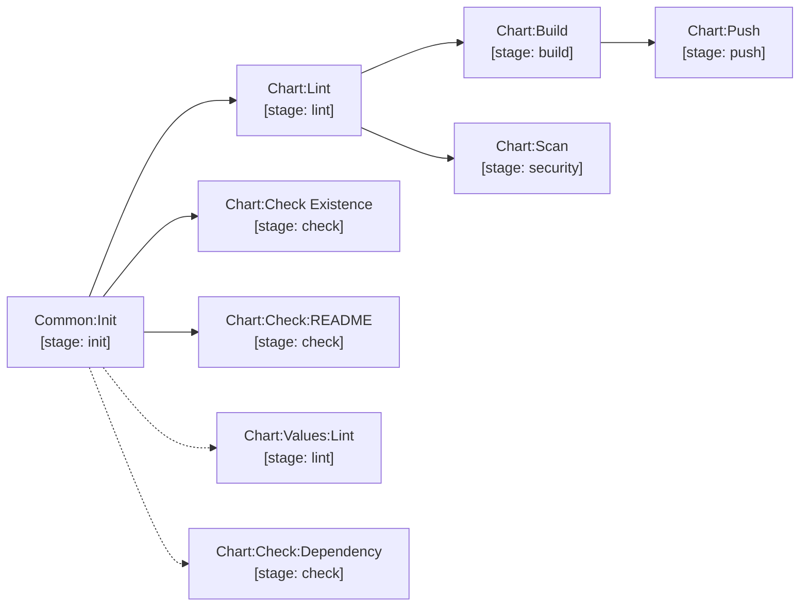

# chart

Helm chart validation, packaging and publishing. A configured `CHART_REGISTRY` selects OCI;
otherwise publishing uses the current project's GitLab Helm Package Registry.
See [registry configuration](../configuration.md#helm-chart-publishing--authentication).

> Dotted jobs (`Chart:Values:Lint`, `Chart:Check:Dependency`) run on merge requests and under
> the `lint` / `check` / `full-pipeline` workflows, but are **excluded from `chart-build-and-push`**.

| Job | Stage | Description |
| --- | --- | --- |
| `Chart:Lint` | `lint` | `helm lint --strict` with optional value overrides. |
| `.Chart:UnitTest` | `test` | **Optional, opt-in.** Renders a mock consumer chart at `${CHART_DIR}/${MOCK_CHART}` (default `tests`) and runs its `${MOCK_CHART}/tests/*_test.yaml` suite glob with `helm unittest --strict`; a missing suite is an error and JUnit is published. Hidden template — declare `Chart:UnitTest: {extends: .Chart:UnitTest}` to enable. For repositories that *ship* a chart others depend on; requires the `unittest` Helm plugin in the job image. |
| `Chart:Check Existence` | `check` | Checks for version collisions in the selected backend. Authentication and network errors fail the check. |
| `Common:Check:Library:Pin` | `check` | Fails when an `include:` pins a branch, a commit or a pre-release instead of a published tag. Covers both `project:`/`ref:` and a `remote:` raw URL whose ref is a path segment. Set `ALLOW_UNSTABLE_LIBRARY_REFS: "true"` to downgrade it to a warning — testing only. |
| `Chart:Check:README` | `check` | Validates that `helm-docs` generated documentation is up to date. |
| `Chart:Check:Dependency` | `check` | Prevents release charts from depending on development chart repositories. *(Not run in `chart-build-and-push`.)* |
| `Chart:Values:Lint` | `lint` | Validates YAML syntax of chart values files. *(Not run in `chart-build-and-push`.)* |
| `Chart:Build` | `build` | Packages chart into `.tgz` artifact using `helm package`. |
| `Chart:Push` | `push` | Publishes to OCI when configured, otherwise GitLab packages (`dev` for candidates, `stable` for releases). Stable pushes optionally mirror to dev. |
| `Chart:Scan` | `security` | Renders templates and runs Trivy. Remote charts (`TARGET_VERSION`) come from the selected backend; pull failures never substitute a local chart. |
| `Chart:Promote` | `release` | Pulls a candidate from the selected backend, repackages at the release tag and publishes to production. |

[Documentation index](../../README.md)
