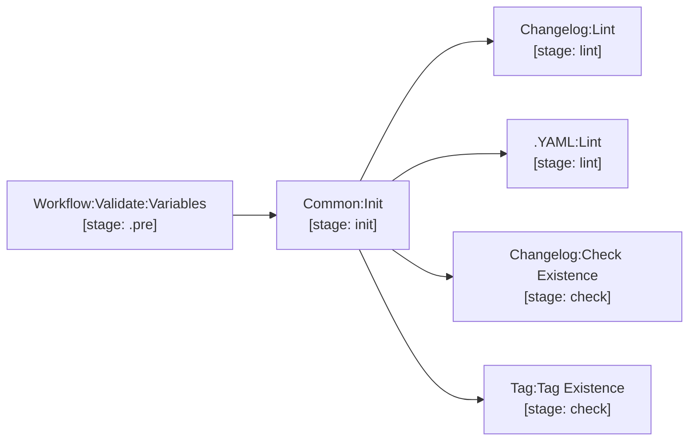

# common

The core backbone included in all pipelines. Computes semantic versions, manages `init.env`, and provides standard rule anchors and Trivy scanner scripts.

| Job / Template | Stage | Description |
| --- | --- | --- |
| `Common:Init` | `init` | Calculates `RELEASE_VERSION`, `APP_PUSH_VERSION`, `TAG`, `MAJOR_VERSION`, `MINOR_VERSION`, `CHART_NAME`, `CHART_PUSH_VERSION`. Exports `init.env`. |
| `Changelog:Lint` | `lint` | Validates keepachangelog format in `CHANGELOG.md`. |
| `Changelog:Check Existence` | `check` | Ensures `CHANGELOG.md` contains an entry for the version being released. |
| `Tag:Tag Existence` | `check` | Fails if the git tag already exists in the repository. |
| `Workflow:Validate:Variables` | `.pre` | Validates required inputs during manual `deploy` (checks `DEPLOY_TARGET`), `image-scan` (checks `TARGET_VERSION`), and `chart-scan` (checks local or remote chart). |
| `.scan-script` | — | Base Trivy scanning engine supporting image, config, license, and SBOM scanners. |
| `.MD:Lint` | `lint` | Reusable Markdownlint template for `LINT_MD_FILES`. |
| `.YAML:Lint` | `lint` | Reusable yamllint template for `LINT_YAML_FILES`. |

[Documentation index](../../README.md)
