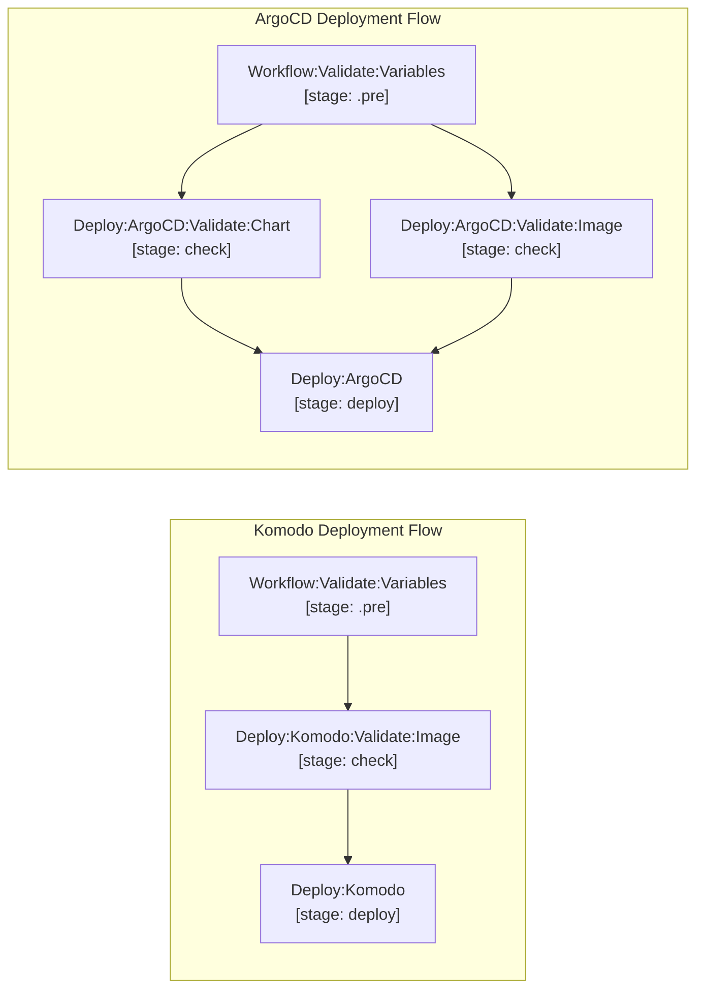

# deploy/gitops

Multi-environment GitOps deployment generators for Komodo and ArgoCD using GitLab CI Component Inputs. Every deployment pipeline automatically executes mandatory pre-flight registry validation jobs in `stage: check` prior to running `stage: deploy`:



- **Komodo**: `Deploy:Komodo:Validate:Image:<env>` verifies target container image in OCI registry before `Deploy:Komodo:<env>` begins.
- **ArgoCD**: `Deploy:ArgoCD:Validate:Chart:<env>` and `Deploy:ArgoCD:Validate:Image:<env>` verify target chart and image exist in OCI registry before `Deploy:ArgoCD:<env>` commits GitOps changes and syncs ArgoCD.

## Komodo Deployment Component (`deploy/gitops/.komodo.gitlab-ci.yml`)

Deploys container images to Komodo stacks via GitOps Docker Compose updates and triggers the Komodo API:

```yaml
include:
  - remote: 'https://raw.githubusercontent.com/grootan-devops/gitlab-ci-library/1.0.0/deploy/gitops/.komodo.gitlab-ci.yml'
    inputs:
      environment: staging
      gitops_repo_url: https://gitlab.contoso.com/devops/gitops/komodo.git
      gitops_branch: environments/staging
      gitops_compose_file: app/docker-compose.yml
      gitops_service_image_yq_path: .services.web.image
      komodo_stack_name: web-app-staging
      komodo_sync_timeout: 600
      environment_url: https://staging.contoso.com
```

## ArgoCD Deployment Component (`deploy/gitops/.argocd.gitlab-ci.yml`)

Supports both **Helm-based** (App-of-Apps values) and **Manifest-based** (raw Kubernetes YAML) deployments with strict automated validation:

### Option A: Helm-Based Deployment

```yaml
include:
  - remote: 'https://raw.githubusercontent.com/grootan-devops/gitlab-ci-library/1.0.0/deploy/gitops/.argocd.gitlab-ci.yml'
    inputs:
      environment: production
      gitops_repo_url: https://gitlab.contoso.com/devops/gitops/website-gitops.git
      gitops_branch: myapp/prod
      gitops_chart_values_file: values.yaml
      gitops_chart_app_yq_path: .apps.web
      argocd_apps: acme-cloud-myapp-prod-root acme-cloud-myapp-web-prod
```

### Option B: Manifest-Based Deployment

```yaml
include:
  - remote: 'https://raw.githubusercontent.com/grootan-devops/gitlab-ci-library/1.0.0/deploy/gitops/.argocd.gitlab-ci.yml'
    inputs:
      environment: production
      gitops_repo_url: https://gitlab.contoso.com/devops/gitops/website-gitops.git
      gitops_branch: myapp/prod
      gitops_manifest_file: extras/manifests/clamav/deployment.yaml
      gitops_new_image: clamav/clamav:1.4.0
      argocd_apps: acme-cloud-myapp-extras-prod-clamav
```

### Strict Parameter & Validation Rules (Hard Fail)

- **Host & Token Guards**: Pipelines immediately hard-fail if `gitops_repo_url`, `gitops_branch`, `argocd_server`/`komodo_server`, or `argocd_token`/`komodo_api_key`/`komodo_api_secret` are empty.
- **Mutual Exclusivity**: You cannot specify both `gitops_chart_values_file` and `gitops_manifest_file`.
- **Helm Mode**: If `gitops_chart_values_file` is specified, `gitops_chart_app_yq_path` is strictly mandatory. If `gitops_image_values_file` is also provided, `gitops_image_repo_yq_path` and `gitops_image_tag_yq_path` are both mandatory.
- **Manifest Mode**: If `gitops_manifest_file` is specified, `gitops_new_image` is strictly mandatory. Direct container image update occurs without container name filtering.

## Direct GitLab Deployment Component (`deploy/gitlab/.gitlab-ci.yml`)

```yaml
include:
  - remote: 'https://raw.githubusercontent.com/grootan-devops/gitlab-ci-library/1.0.0/deploy/gitlab/.gitlab-ci.yml'
    inputs:
      environment: production
      environment_name: production
      environment_url: https://myapp.contoso.com
      script:
        - echo "Deploying to production..."
        - ./deploy-script.sh
```

[Documentation index](../../README.md)
