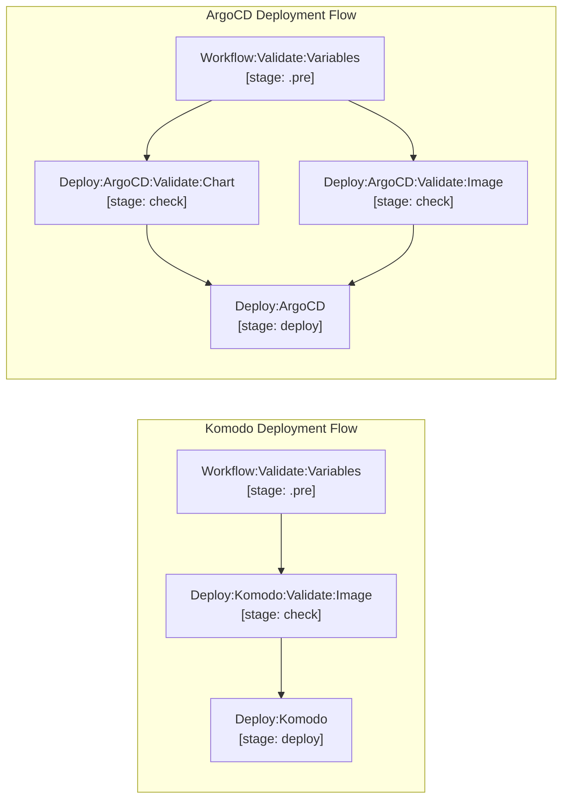

# deploy/gitops

Multi-environment GitOps deployment generators for Komodo and ArgoCD using GitLab CI Component Inputs. Every deployment pipeline automatically executes mandatory pre-flight registry validation jobs in `stage: check` prior to running `stage: deploy`:


```mermaid
flowchart LR
    subgraph Komodo [Komodo Deployment Flow]
        WVV1["Workflow:Validate:Variables<br/>[stage: .pre]"] --> DKVI["Deploy:Komodo:Validate:Image<br/>[stage: check]"]
        DKVI --> DK["Deploy:Komodo<br/>[stage: deploy]"]
    end
    subgraph ArgoCD [ArgoCD Deployment Flow]
        WVV2["Workflow:Validate:Variables<br/>[stage: .pre]"] --> DAVC["Deploy:ArgoCD:Validate:Chart<br/>[stage: check]"]
        WVV2 --> DAVI["Deploy:ArgoCD:Validate:Image<br/>[stage: check]"]
        DAVC & DAVI --> DA["Deploy:ArgoCD<br/>[stage: deploy]"]
    end
```

- **Komodo**: `Deploy:Komodo:Validate:Image:<env>` verifies target container image in OCI registry before `Deploy:Komodo:<env>` begins.
- **ArgoCD**: `Deploy:ArgoCD:Validate:Chart:<env>` and `Deploy:ArgoCD:Validate:Image:<env>` verify the target chart and image exist before `Deploy:ArgoCD:<env>` commits GitOps changes and syncs ArgoCD. The chart is checked where `Chart:Push` publishes it: the GitLab Helm channel `dev` for candidates or `stable` for releases (`HELM_CHANNEL` overrides), or the OCI release or candidate path. Set `validate_image: false` when the deployed chart does not use an image built by the project.

## Komodo Deployment Component (`deploy/gitops/.komodo.gitlab-ci.yml`)

Deploys container images to Komodo stacks via GitOps Docker Compose updates and triggers the Komodo API:

```yaml
include:
  - remote: 'https://raw.githubusercontent.com/grootan-devops/gitlab-ci-library/1.8.1/deploy/gitops/.komodo.gitlab-ci.yml'
    inputs:
      environment: staging
      gitops_repo_url: https://gitlab.contoso.com/devops/gitops/komodo.git
      gitops_branch: environments/staging
      gitops_compose_file: app/docker-compose.yml
      gitops_service_image_yq_path: .services.web.image
      komodo_stack_name: web-app-staging
      komodo_sync_timeout: 600
      environment_url: https://staging.contoso.com
```

## ArgoCD Deployment Component (`deploy/gitops/.argocd.gitlab-ci.yml`)

Supports both **Helm-based** (App-of-Apps values) and **Manifest-based** (raw Kubernetes YAML) deployments with strict automated validation:

### Option A: Helm-Based Deployment

```yaml
include:
  - remote: 'https://raw.githubusercontent.com/grootan-devops/gitlab-ci-library/1.8.1/deploy/gitops/.argocd.gitlab-ci.yml'
    inputs:
      environment: production
      gitops_repo_url: https://gitlab.contoso.com/devops/gitops/website-gitops.git
      gitops_branch: myapp/prod
      gitops_chart_values_file: values.yaml
      gitops_chart_app_yq_path: .apps.web
      argocd_apps: acme-cloud-myapp-prod-root acme-cloud-myapp-web-prod
```

### Option B: Manifest-Based Deployment

```yaml
include:
  - remote: 'https://raw.githubusercontent.com/grootan-devops/gitlab-ci-library/1.8.1/deploy/gitops/.argocd.gitlab-ci.yml'
    inputs:
      environment: production
      gitops_repo_url: https://gitlab.contoso.com/devops/gitops/website-gitops.git
      gitops_branch: myapp/prod
      gitops_manifest_file: extras/manifests/clamav/deployment.yaml
      gitops_new_image: clamav/clamav:1.4.0
      argocd_apps: acme-cloud-myapp-extras-prod-clamav
```

### Strict Parameter & Validation Rules (Hard Fail)

- **Host & Token Guards**: Pipelines immediately hard-fail if `gitops_repo_url`, `gitops_branch`, `argocd_server`/`komodo_server`, or `argocd_token`/`komodo_api_key`/`komodo_api_secret` are empty.
- **Mutual Exclusivity**: You cannot specify both `gitops_chart_values_file` and `gitops_manifest_file`.
- **Helm Mode**: If `gitops_chart_values_file` is specified, `gitops_chart_app_yq_path` is strictly mandatory. If `gitops_image_values_file` is also provided, `gitops_image_repo_yq_path` and `gitops_image_tag_yq_path` are both mandatory.
- **Manifest Mode**: If `gitops_manifest_file` is specified, `gitops_new_image` is strictly mandatory. Direct container image update occurs without container name filtering.
- **GitOps repository credentials**: Both components clone and push the GitOps repository with `gitops_repo_token` (username `gitops_repo_username`, default `oauth2`), falling back to the `GITOPS_REPO_TOKEN` / `GITOPS_REPO_USERNAME` CI/CD variables and then to `CI_JOB_TOKEN`. Use a token with `write_repository`, such as a project access token on the GitOps project, when the GitOps repository is another project and GitLab is older than 19 (`CI_JOB_TOKEN` cross-project push). Pass it as a masked variable, e.g. `gitops_repo_token: "$GITOPS_REPO_TOKEN"`.
- **Chart repoURL**: In Helm mode `Deploy:ArgoCD:<env>` writes `<gitops_chart_app_yq_path>.chart.repoURL` for the channel or OCI path that holds `TARGET_VERSION`, and `.chart.version` as `TARGET_VERSION`.

[Documentation index](../../README.md)
