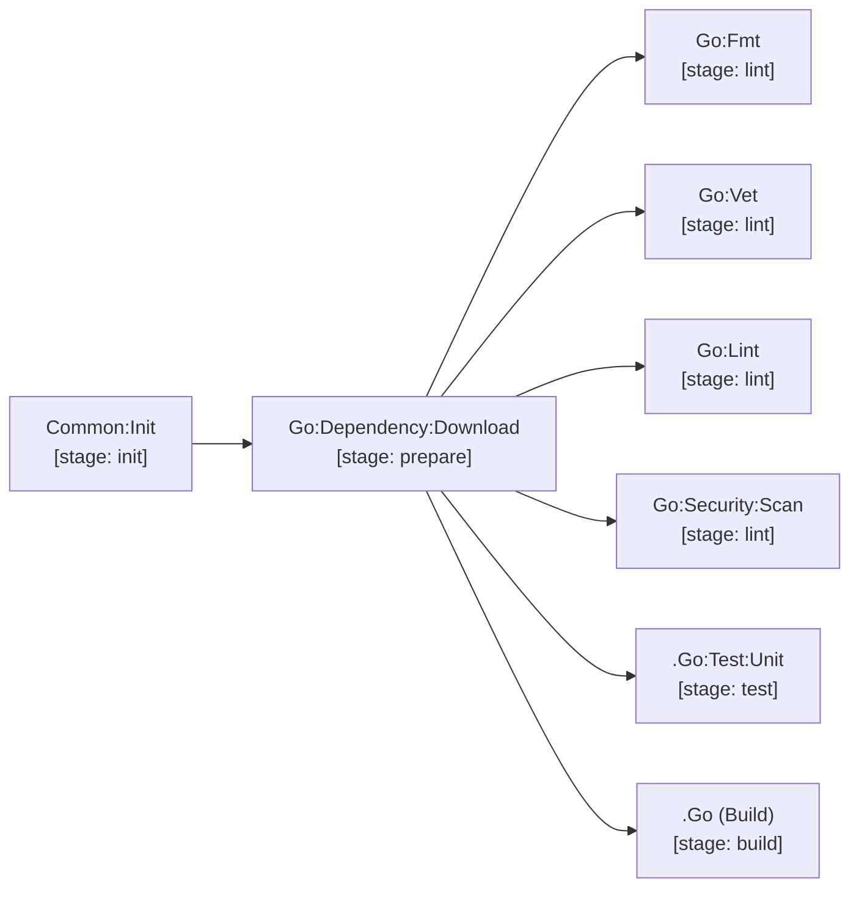

# golang

Go microservice and CLI pipeline with automated formatting, vet directives, and security scanning.

| Job / Template | Type | Stage | Description |
| --- | --- | --- | --- |
| `Go:Dependency:Download` | Job | `prepare` | Warms Go module cache via `go mod download`. |
| `Go:Fmt` | Job | `lint` | Enforces `go fmt` compliance. |
| `Go:Vet` | Job | `lint` | Runs `go vet` with `// govet:ignore` suppression support. |
| `Go:Lint` | Job | `lint` | Comprehensive linting with `golangci-lint`. |
| `Go:Security:Scan` | Job | `lint` | Static security audit with `gosec`. |
| `.Go` | Template | `build` | Go build base image + cache configuration. |
| `.Go:Test:Unit` | Template | `test` | Unit test runner with JUnit conversion. |

[Documentation index](../../README.md)
