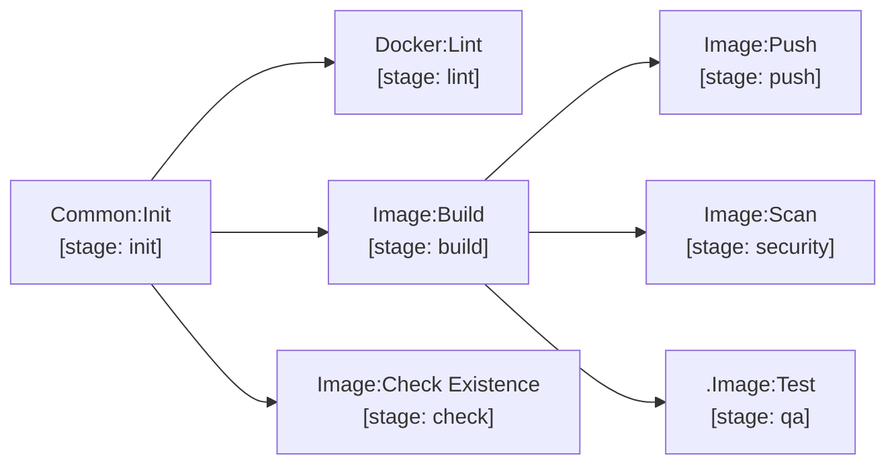

# image

Container image building and registry management supporting both Docker and Buildah.

| Job / Template | Stage | Description |
| --- | --- | --- |
| `Docker:Lint` | `lint` | Hadolint Dockerfile linting with configurable ignores. |
| `Image:Build` | `build` | Docker/BuildKit build with build-args injection and registry cache. Saves image tar artifact. |
| `Image:Check Existence` | `check` | Verifies image tag does not already exist in registry before release. |
| `Image:Push` | `push` | Publishes image to registry. Automatically tags `latest`, `MAJOR`, and `MINOR` on production release. |
| `Image:Scan` | `security` | Trivy CVE scan on local image tar (or pulls remote image in `image-scan` workflow). |
| `.Image:Test` | `qa` | Runs `ci_image_test.sh` **inside the built image** before it is scanned or pushed. Opt-in: extend it only where the image has a contract worth asserting — entrypoint on `PATH`, `EXPOSE` port listening, process running as `10001`. GitHub's equivalent is `docker.yml` `test: true`. |

[Dockerfile standards and examples](../docker.md) · [Documentation index](../../README.md)
