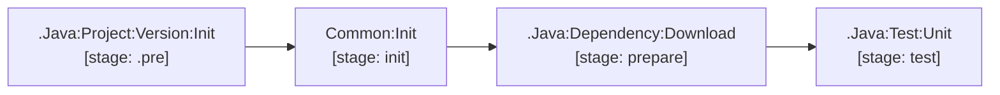

# java

Consumers define `Java:Dependency:Download` by extending `.Java:25` and
`.Java:Dependency:Download`. It warms the Maven `.m2` cache with the shared
`PROJECT_CACHE_KEY`; downstream build and test jobs restore that cache.

Java / Maven lifecycle support for Java 25 microservices.

| Job / Template | Type | Stage | Description |
| --- | --- | --- | --- |
| `.Java:25` | Template | — | Java 25 CI build image + `.m2` local repository cache. |
| `.Java:Project:Version:Init` | Template | `.pre` | Extracts `project.version` from `pom.xml`. |
| `.Java:Dependency:Download` | Template | `prepare` | Runs `mvn dependency:go-offline`. |
| `.Java:Test:Unit` | Template | `test` | Maven test runner with Surefire XML report collection. |

[Documentation index](../../README.md)
