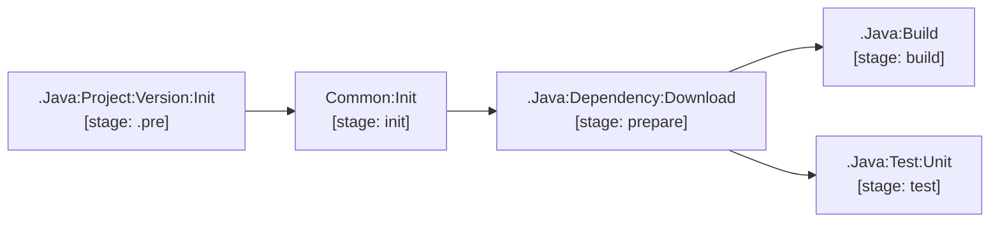

# java

Consumers define `Java:Dependency:Download` by extending `.Java:25` and
`.Java:Dependency:Download`. It warms the Maven `.m2` cache with the shared
`PROJECT_CACHE_KEY`; downstream build and test jobs restore that cache.

Java / Maven lifecycle support for Java 25 microservices.

```mermaid
flowchart LR
    JPVI[".Java:Project:Version:Init<br/>[stage: .pre]"] --> CI["Common:Init<br/>[stage: init]"]
    CI --> JDD[".Java:Dependency:Download<br/>[stage: prepare]"]
    JDD --> JB[".Java:Build<br/>[stage: build]"]
    JDD --> JTU[".Java:Test:Unit<br/>[stage: test]"]
```

| Job / Template | Type | Stage | Description |
| --- | --- | --- | --- |
| `.Java:25` | Template | — | Java 25 CI build image + `.m2` local repository cache. |
| `.Java:Project:Version:Init` | Template | `.pre` | Extracts `project.version` from `pom.xml`. |
| `.Java:Dependency:Download` | Template | `prepare` | Runs `mvn dependency:go-offline --batch-mode --no-transfer-progress -T 1C` (non-interactive, parallel). |
| `.Java:Build` | Template | `build` | Runs `mvn clean install` with the pulled `.m2` cache; needs `Java:Dependency:Download`. Combine with `.Java:25`. |
| `.Java:Test:Unit` | Template | `test` | Maven test runner with Surefire XML report collection. |

## Project rules

- Maven runs in batch mode (`mvn -B`), or the log fills with download progress.
- `package -DskipTests` and `test` are separate, so a test failure does not rebuild.
- The local repository (`~/.m2`, or Gradle's cache) is cached under one stable key shared by
  its warmer and its readers.

[Documentation index](../../README.md)
