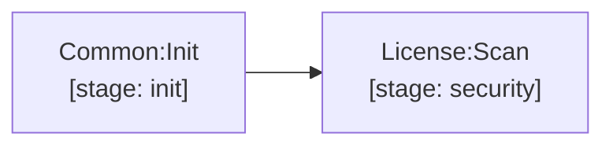

# license

`License:Scan` (stage `security`): Single unified Trivy repository filesystem scanner (`trivy fs --scanners license --license-full .`). Checks all package dependencies against allowed license policies.

[Documentation index](../../README.md)
