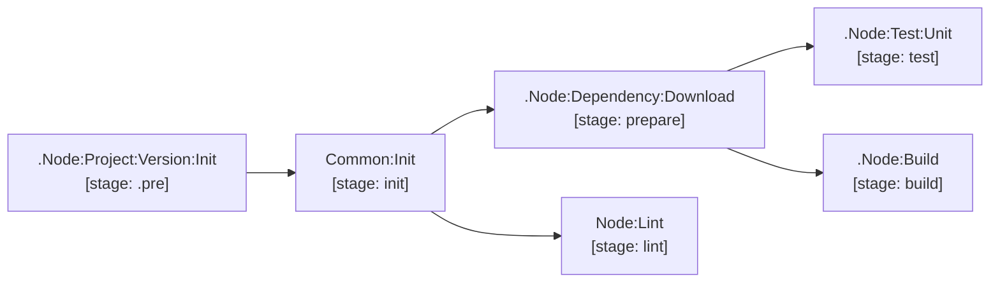

# nodejs

Full lifecycle support for Node.js / TypeScript / Frontend / Backend applications using npm and Biome.

| Job / Template | Type | Stage | Description |
| --- | --- | --- | --- |
| `.Node:24` | Template | — | Node.js 24 base image + `.npm` caching configuration. |
| `.Node:Project:Version:Init` | Template | `.pre` | Reads `.version` from `package.json` and writes `version.env`. |
| `.Node:Dependency:Download` | Template | `prepare` | Runs `npm ci --include=dev` into the `.npm` cache. |
| `.Node:Build` | Template | `build` | Standard build template with pull cache and dependencies on `Common:Init` and `Node:Dependency:Download`. |
| `Node:Lint` | Job | `lint` | Runs `biome check` against `biome.json`. |
| `.Node:Test:Unit` | Template | `test` | Base unit test job with JUnit artifact collection and pull cache. |

[Documentation index](../../README.md)
