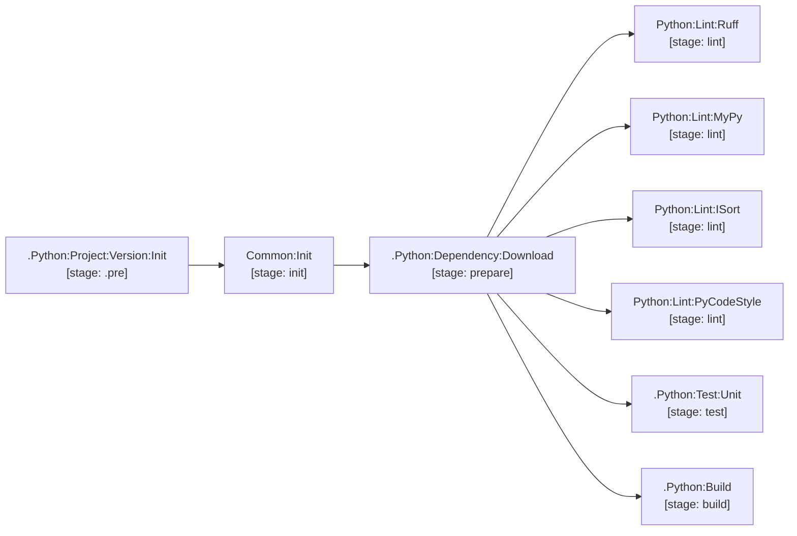

# python

Python service lifecycle management powered by `uv`, Ruff, and MyPy.

Consumers define `Python:Dependency:Download` by extending `.Python:12` and
`.Python:Dependency:Download`. This stack-scoped job warms the `.uv` cache under
`PROJECT_CACHE_KEY`; `Image:Build` restores the same key and cache path for offline
Dockerfile dependency installation. See the [complete Python example](../examples/python.md).

The `.Python:12` CI anchor uses the toolkit's Python 3.12 build image (not the production
micro image) and clears its container entrypoint with `entrypoint: [""]`.
GitLab Runner supplies the shell command; do not override this with `["/bin/bash"]`,
which can cause Bash to interpret Runner's shell executable as a script and fail with
`cannot execute binary file`. Consumers extending `.Python:12` inherit this setting.
The production `${PYTHON_312_MICRO_BASE_IMAGE}` is used by the Dockerfile only.

| Job / Template | Type | Stage | Description |
| --- | --- | --- | --- |
| `.Python:12` | Template | — | Python 3.12 CI build image + `.uv` cache; entrypoint is cleared for GitLab Runner. |
| `.Python:Project:Version:Init` | Template | `.pre` | Extracts version from `pyproject.toml`. |
| `.Python:Dependency:Download` | Template | `prepare` | Warms `.uv` cache via `uv sync --frozen --no-install-project --no-install-workspace`. |
| `.Python:Build` | Template | `build` | Compiles wheel/sdist archives to `dist/` via `uv build --offline`. |
| `Python:Lint:Ruff` | Job | `lint` | Ruff linting. |
| `Python:Lint:MyPy` | Job | `lint` | Static type checking. |
| `Python:Lint:ISort` | Job | `lint` | Import order formatting validation. |
| `Python:Lint:PyCodeStyle` | Job | `lint` | PEP8 code style enforcement. |
| `.Python:Test:Unit` | Template | `test` | Unit test execution base with JUnit report collection. |

[Documentation index](../../README.md)
