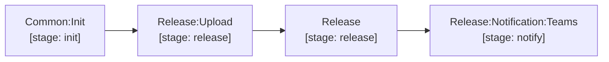

# release & notify

The `release/.gitlab-ci.yml` module provides the complete release lifecycle and notification dispatch:

- `Release:Upload`: Fetches upstream Merge Request reports via GitLab API (`$CI_JOB_TOKEN`), uploads release assets (Trivy report bundle, installed packages, SBOM, `${CHART_NAME}-${TAG}.tgz`, test report archive, and requested additional artifacts) to the Generic Package Registry, and exports the scoped markdown summaries, including `${RELEASE_MIGRATION_FILE_NAME}`, as job artifacts for the release description. Migration notes are not uploaded to the package registry by default.
- `Release`: Receives the scoped markdown summaries directly from `Release:Upload` via `needs: [{ job: Release:Upload, artifacts: true }]` (zero heavy archive transfer) and generates the formal GitLab Release with consolidated changelog, migration notes, CVE summary tables, image SHA digests, chart info, license audit, and clickable asset download links.
- `Release:Notification:Teams`: Dispatches Microsoft Teams Adaptive Cards with commit, branch, author avatar, release links, and SonarQube status buttons via Power Automate webhook URL (`RELEASE_MESSAGE_TEAMS_WORKFLOWS_URL`).

[Documentation index](../../README.md)
