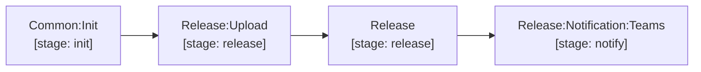

# release & notify

The `release/.gitlab-ci.yml` module provides the complete release lifecycle and notification dispatch:

- `Release:Upload`: Automatically fetches pre-generated verification reports and summaries from the upstream Merge Request pipeline via GitLab API (`$CI_JOB_TOKEN`), packages and uploads release assets (`*_${TRIVY_SCAN_REPORT_NAME_SUFFIX}.tar.gz`, `${INSTALLED_PCKG_FILE_NAME}`, `${CHART_NAME}-${CHART_PUSH_VERSION}.tgz`, `${TEST_REPORT_DIR}.tar.gz`, `${ADDITIONAL_RELEASE_ARTIFACT}`) to the GitLab Generic Package Registry, and exports only the scoped markdown summaries (`${IMAGE_INFO_FILE_NAME}`, `${IMAGE_CVE_INFO_FILE_NAME}`, `${CHART_INFO_FILE_NAME}`, `${CHART_CVE_INFO_FILE_NAME}`, `${TF_MD_FILE_NAME}`, `${TF_CVE_INFO_FILE_NAME}`, `${LICENSE_INFO_FILE_NAME}`, `${SBOM_CVE_INFO_FILE_NAME}`, `${RELEASE_CHANGELOG_FILE_NAME}`, `${RELEASE_MIGRATION_FILE_NAME}`) as lightweight job artifacts.
- `Release`: Receives the scoped markdown summaries directly from `Release:Upload` via `needs: [{ job: Release:Upload, artifacts: true }]` (zero heavy archive transfer) and generates the formal GitLab Release with consolidated changelog, migration notes, CVE summary tables, image SHA digests, chart info, license audit, and clickable asset download links.
- `Release:Notification:Teams`: Dispatches Microsoft Teams Adaptive Cards with commit, branch, author avatar, release links, and SonarQube status buttons via Power Automate webhook URL (`RELEASE_MESSAGE_TEAMS_WORKFLOWS_URL`).

[Documentation index](../../README.md)
