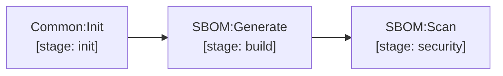

# sbom

CycloneDX Software Bill of Materials generation and vulnerability scanner:

- `SBOM:Generate` (stage `build`): Generates `sbom.cdx.json`.
- `SBOM:Scan` (stage `security`): Scans SBOM components for CVEs via Trivy server.

[Documentation index](../../README.md)
