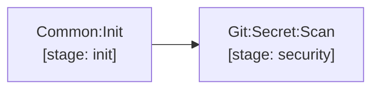

# secret-scanning

`Git:Secret:Scan` (stage `security`): Betterleaks secret detection across complete repository commit history. Detected secrets are masked from job logs.

[Documentation index](../../README.md)
