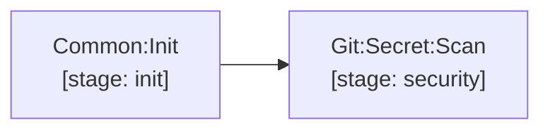

# secret-scanning

```mermaid
flowchart LR
    CI["Common:Init<br/>[stage: init]"] --> GSS["Git:Secret:Scan<br/>[stage: security]"]
```

`Git:Secret:Scan` (stage `security`): Betterleaks secret detection across complete repository commit history. Detected secrets are masked from job logs.

A repository with findings already in its history — typically a fork — keeps the job and
commits a `.betterleaksignore` at its root instead of disabling the scan. Each entry is the
SHA-256 fingerprint of one reviewed value (`betterleaks fingerprint`), and it suppresses that
value wherever it appears. List only values that were revoked or are not secrets. Inline
`gitleaks:allow` comments are ignored (`--ignore-gitleaks-allow`), and `.gitleaksignore` is not
read.

[Documentation index](../../README.md)
