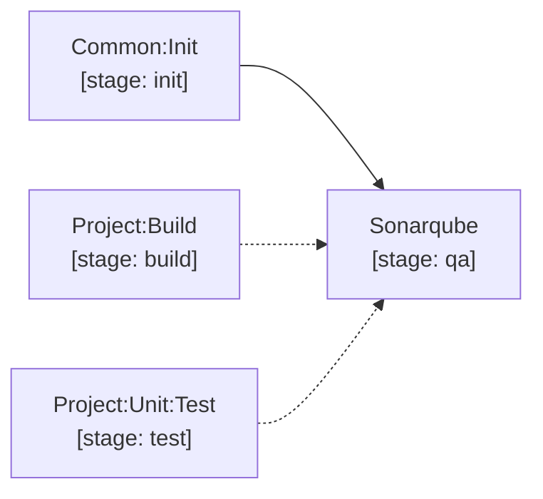

# sonarqube

`Sonarqube` (stage `qa`): Runs `sonar-scanner` with `sonar.properties`. Automatically pulls full git history (`GIT_DEPTH: 0`), ingests coverage and unit test reports, and enforces the SonarQube Quality Gate.

[Documentation index](../../README.md)
