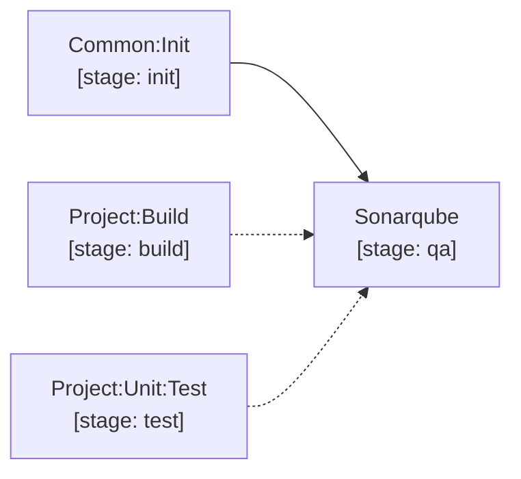

# sonarqube

```mermaid
flowchart LR
    CI["Common:Init<br/>[stage: init]"] --> SQ["Sonarqube<br/>[stage: qa]"]
    PB["Project:Build<br/>[stage: build]"] -.-> SQ
    PUT["Project:Unit:Test<br/>[stage: test]"] -.-> SQ
```

`Sonarqube` (stage `qa`): Runs `sonar-scanner` with `sonar.properties`. Automatically pulls full git history (`GIT_DEPTH: 0`), ingests coverage and unit test reports, and enforces the SonarQube Quality Gate.

The job runs in `${SONAR_SCANNER_CLI_IMAGE_REPO}:${SONAR_SCANNER_CLI_IMAGE_TAG}` (default `sonarsource/sonar-scanner-cli:12.2.0.4256_8.1.0`).

[Documentation index](../../README.md)
