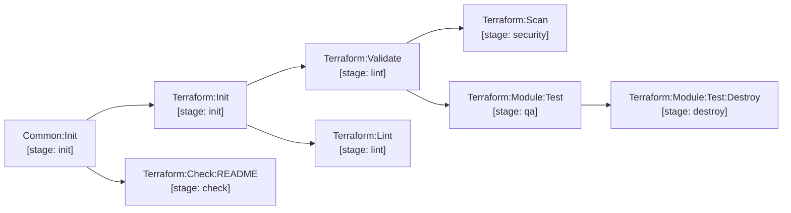

# terraform

Terraform infrastructure services and reusable module verification.



- **Service (`terraform/.gitlab-ci.yml`)**: `Terraform:Init` &rarr; `Terraform:Validate` &rarr; `Terraform:Lint` &rarr; `Terraform:Check:README` &rarr; `Terraform:Scan`.
- **Module Test (`terraform/.test.gitlab-ci.yml`)**: `Terraform:Module:Test` runs Go Terratest suites with automatic `Terraform:Module:Test:Destroy` on failure.

## Consuming a module — no packaging step

Modules are consumed directly from git. There is no package, no registry upload and no
publish job to maintain: the git ref *is* the version.

```hcl
module "vpc" {
  source = "git::git@gitlab.contoso.com:infra/terraform-modules.git//modules/vpc?ref=1.0.0"
}

module "eks" {
  # git::<repo_url>//<sub_folder>?ref=<tag | branch | commit>
  source = "git::git@gitlab.contoso.com:infra/terraform-modules.git//modules/eks?ref=b4f8d29"
}
```

> [!IMPORTANT]
> Always pin `?ref=` to a tag or commit SHA. A branch ref (`?ref=main`) re-resolves on every
> `terraform init`, so a plan can change without the consuming repository changing.

[Documentation index](../../README.md)
