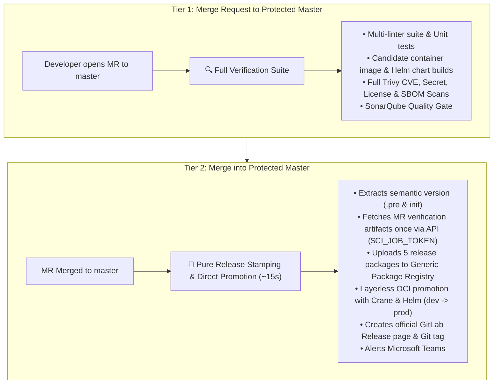
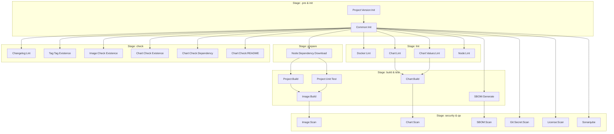
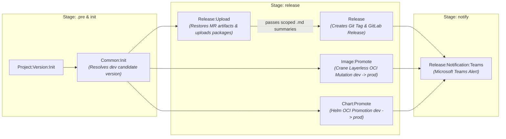
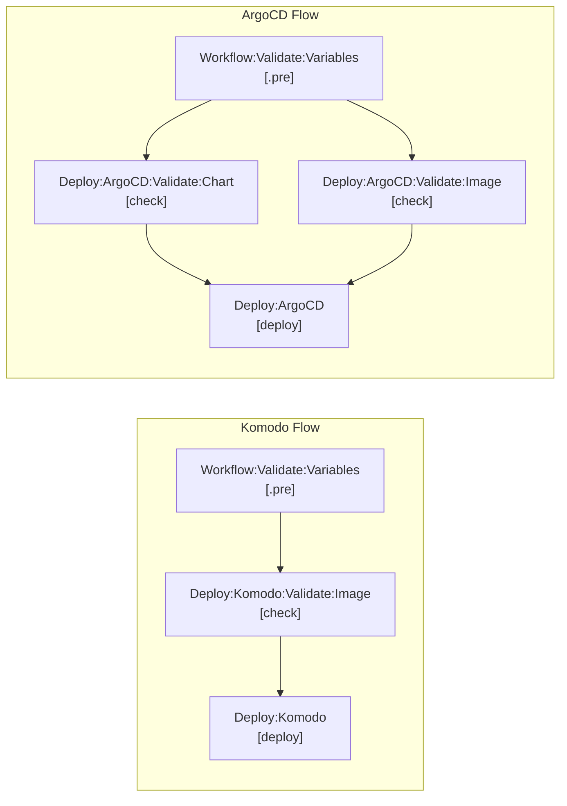
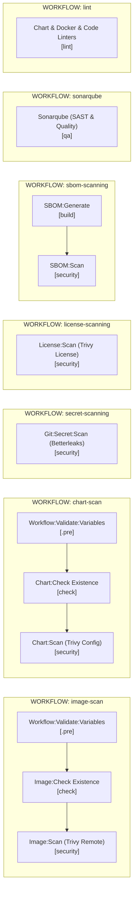

# Pipeline lifecycle

## Pipeline Stages & Lifecycle

Every pipeline follows a strict, standardized linear stage sequence:

```mermaid
flowchart LR
    pre[".pre"] --> init["init"] --> prepare["prepare"] --> lint["lint"] --> test["test"] --> build["build"] --> push["push"] --> security["security"] --> qa["qa"] --> report["report"] --> check["check"] --> deploy["deploy"] --> release["release"] --> notify["notify"] --> trigger["trigger"] --> destroy["destroy"] --> post[".post"]
```

| Stage | Purpose | Typical Jobs |
| --- | --- | --- |
| `.pre` | Pre-flight variable validation & version discovery | `Workflow:Validate:Variables` *(gatekeeper)*, `Project:Version:Init` |
| `init` | Environment initialization & metadata resolution | `Common:Init`, `Terraform:Init` |
| `prepare` | Warm package manager caches (with dev dependencies) | `Node:Dependency:Download`, `Python:Dependency:Download`, `Go:Dependency:Download` |
| `lint` | Code style, syntax, YAML, Hadolint linting | `Node:Lint`, `Python:Lint:*`, `Docker:Lint`, `Chart:Lint`, `Changelog:Lint` |
| `test` | Unit testing & code coverage reports | `Project:Unit:Test` (`.Node:Test:Unit`, `.Python:Test:Unit`, `.Go:Test:Unit`) |
| `build` | Compile code, package container images, package Helm charts | `Project:Build`, `Image:Build`, `Chart:Build`, `SBOM:Generate` |
| `push` | Publish candidate artifacts to dev registries | `Image:Push`, `Chart:Push` |
| `security` | Trivy vulnerability, misconfiguration, license, secret scans | `Image:Scan`, `Chart:Scan`, `License:Scan`, `Git:Secret:Scan`, `SBOM:Scan` |
| `qa` | Quality gates, SonarQube analysis, container verification | `Sonarqube`, `Terraform:Module:Test`, `.Image:Test` |
| `report` | Report aggregation & parsing | Reserved for multi-job metric collection |
| `check` | Release prerequisite & deployment pre-flight verification | `Tag:Tag Existence`, `Changelog:Check Existence`, `Deploy:*:Validate:*` |
| `deploy` | GitOps repository updates & sync | `Deploy:Komodo:<env>`, `Deploy:ArgoCD:<env>` |
| `release` | GitLab Release creation & Package Registry upload | `Release:Upload`, `Release`, `Promote:Image`, `Promote:Chart` |
| `notify` | Webhook notifications (Microsoft Teams Adaptive Cards) | `Release:Notification:Teams`, `Promote:Notification:Teams` |
| `trigger` | Child pipeline orchestration for monorepos | Sub-project trigger jobs |
| `destroy` | Infrastructure cleanup on pipeline failure | `Terraform:Module:Test:Destroy` |
| `.post` | Final pipeline cleanup | Reserved |

---

## Execution Model & Trigger Strategy

### The Two-Tier Release Model

The library implements an enterprise **Two-Tier Release Model** designed for maximum developer velocity, zero redundant builds, and complete supply-chain compliance:

- **Silenced Feature Branches**: Direct pushes to developer branches (`dev`, `feature/*`) and MRs between non-master branches produce **0 pipelines**, eliminating wasteful runner consumption.
- **Master Branch Protection (Manual Triggers)**: If `full-pipeline`, `image-build-and-push`, or `chart-build-and-push` are manually triggered on `master` or protected `*/master` via Web UI or API, `Common:Init` automatically forces a `-rc.<pipeline_id>` suffix on all image/chart versions and routes to the **dev registry** (`IMAGE_DEV_REPOSITORY_SUFFIX`). This prevents accidental overwrite of stable production artifacts.
- **Dual Deployment Integration**:
  - **`WORKFLOW: full-pipeline`**: Deployment jobs (`Deploy:Komodo:<env>` and `Deploy:ArgoCD:<env>`) appear directly in `stage: deploy` with manual 1-click play buttons (`when: manual`, `allow_failure: true`) that automatically pick up `APP_PUSH_VERSION` / `CHART_PUSH_VERSION` / `TAG` from `Common:Init`.
  - **`WORKFLOW: deploy`**: Targeted on-demand deploy running automatically (`when: on_success`) for the specified `$DEPLOY_TARGET` after validating inputs in `stage: .pre` and verifying existing images/charts in `stage: check`.
- **All upstream `needs:` dependencies** are configured with `optional: true` so single-focus workflows run independently without waiting on skipped stages.

---

### Available Manual Workflows (`WORKFLOW`)

Triggered on demand via GitLab **Web UI (Run pipeline)** or **API triggers** using the `WORKFLOW` variable:

| `WORKFLOW` Value | Dynamic Pipeline Title | Description | Key Inputs |
| --- | --- | --- | --- |
| `full-pipeline` *(default)* | `▶️ Manual Full Pipeline Run` | Runs the complete end-to-end build, test, scan, package, push, and deploy/release flow. | `TARGET_VERSION` *(optional)* |
| `build` | `▶️ Build & Unit Test Verification` | Fast-track verification: resolves version, downloads dependencies, builds project, and executes unit tests without packaging images/charts. | — |
| `check` | `▶️ Release Prerequisites & Conflict Check` | Standalone pre-flight guard: validates git tag availability, image tag, chart version in registry, chart docs, and dependencies without building. | — |
| `deploy` | `▶️ Deploy to <TARGET>` | Triggers targeted GitOps deployment to a specified platform & environment without building. | `DEPLOY_TARGET` *(required)*, `TARGET_VERSION` *(optional)* |
| `image-build-and-push` | `▶️ Container Image Build & Push` | Builds Dockerfile/Buildah, publishes image tags to registry, and runs CVE scan. | `TARGET_VERSION` *(optional)* |
| `image-scan` | `▶️ Container Image Vulnerability Scan` | Authenticates and scans an existing remote image tag (stable `x.y.z` from prod, pre-release from dev). | `TARGET_VERSION` *(required)* |
| `chart-build-and-push` | `▶️ Helm Chart Package & Push` | Runs `helm lint`, packages and publishes to configured OCI or, with no `CHART_REGISTRY`, GitLab packages (`dev` for candidates, `stable` for releases). Runs a config scan. Values linting and dependency checks are **excluded** — use `lint` / `check` for those. | `TARGET_VERSION` *(optional)* |
| `chart-scan` | `▶️ Helm Chart Security & Config Scan` | Renders and scans local chart files, or pulls `TARGET_VERSION` from the selected OCI/GitLab package backend. | `TARGET_VERSION` *(optional)*, `HELM_TEST_VALUES` *(optional)* |
| `license-scanning` | `▶️ License Compliance Scan` | Audits local repository dependencies against open-source license compliance rules (always local). | — |
| `sbom-scanning` | `▶️ SBOM Generation & Security Scan` | Generates CycloneDX `sbom.cdx.json` from local repository and scans component packages for CVEs. | `SBOM_FILE` *(optional)* |
| `secret-scanning` | `▶️ Secret Scanning Security Audit` | Scans entire git history with Betterleaks for exposed API keys, secrets, and credentials (always local). | — |
| `sonarqube` | `▶️ SonarQube Code Quality Scan` | Runs `sonar-scanner` and checks quality gate metrics against SonarQube server. | — |
| `lint` | `▶️ Code & Config Linting` | Executes language linters (Biome, Ruff, Hadolint, yamllint, etc.) on local workspace. | — |

---

### Comprehensive Execution Matrix

| # | Workflow / Trigger Mode | Trigger Source | Automatic? | Stage Count | Job Count | Scope & Primary Purpose |
| --- | --- | --- | :---: | :---: | :---: | --- |
| **1** | **MR to Protected Master** | `merge_request_event` to `master` / `*/master` (protected) | ✅ **Yes** | 10 | 27 | **Full Verification Suite**: Linters, unit tests, candidate container image & chart builds, CVE security scans, and SonarQube quality gate. |
| **2** | **Production Release (Multi-Master)** | `push` / merge to `default_branch` (`master`) or protected `*/master` | ✅ **Yes** | 4 | 5 | **Lightweight Release Tagging & OCI Promotion**: Stamped on merge (~15s). Restores verification artifacts from MR, promotes candidate image/chart to prod via Crane & Helm, creates GitLab release, stamps Git tag, and alerts Teams. Zero builds/tests/scans. |
| **3** | **Branch Push & Non-Master MR** | `push` to `dev` / `feature/*` or MR to `dev` | ❌ **No** | 0 | 0 | **Silenced / No Pipeline**: Prevents wasteful runner minute consumption on developer branch commits. |
| **4** | **Deploy (Komodo / ArgoCD)** | `web` / `api` (`WORKFLOW: deploy`) | 🔘 **Manual** | 3 | 3 | **Targeted GitOps Deployment**: Validates target in `.pre`, verifies image/chart existence in `check`, and deploys directly without rebuilding. |
| **5** | **Container Image Scan** | `web` / `api` (`WORKFLOW: image-scan`) | 🔘 **Manual** | 3 | 3 | **Remote Image Scan**: Validates `TARGET_VERSION` in `.pre`, checks existence in registry (`check`), and executes Trivy scan (`security`). |
| **6** | **Helm Chart Scan** | `web` / `api` (`WORKFLOW: chart-scan`) | 🔘 **Manual** | 3 | 3 | **Helm Security Scan**: Validates chart target in `.pre`, checks existence (`check`), renders templates, and runs Trivy scan (`security`). |
| **7** | **Git Secret Scan** | `web` / `api` (`WORKFLOW: secret-scanning`) | 🔘 **Manual** | 1 | 1 | **Secret Audit**: Scans full git commit history for credentials and leaked tokens (isolated, zero `.pre` / `init` overhead). |
| **8** | **License Compliance Scan** | `web` / `api` (`WORKFLOW: license-scanning`) | 🔘 **Manual** | 1 | 1 | **Open Source Audit**: Validates dependency licenses against compliance policies (isolated, zero `.pre` / `init` overhead). |
| **9** | **SBOM Generation & Scan** | `web` / `api` (`WORKFLOW: sbom-scanning`) | 🔘 **Manual** | 2 | 2 | **SBOM Audit**: Generates CycloneDX SBOM and scans component inventory for vulnerabilities (isolated, zero `.pre` / `init` overhead). |
| **10** | **SonarQube Analysis** | `web` / `api` (`WORKFLOW: sonarqube`) | 🔘 **Manual** | 1 | 1 | **Code Quality Gate**: Runs SonarScanner and checks coverage & quality gates (isolated, zero `.pre` / `init` overhead). |
| **11** | **Multi-Linter Suite** | `web` / `api` (`WORKFLOW: lint`) | 🔘 **Manual** | 2 | 5 | **Unified Linting**: Executes Biome, Docker Hadolint, Helm lint, values lint, and changelog linters (isolated, zero `.pre` / `init` overhead). |
| **12** | **Image Build & Push** | `web` / `api` (`WORKFLOW: image-build-and-push`) | 🔘 **Manual** | 7 | 8 | **Isolated Image Pipeline**: Builds container image, executes unit tests, scans, and pushes to registry. |
| **13** | **Chart Build & Push** | `web` / `api` (`WORKFLOW: chart-build-and-push`) | 🔘 **Manual** | 7 | 8 | **Isolated Chart Pipeline**: Lints, packages, scans and publishes to the selected chart backend. Jobs: `Common:Init`, `Trivy:Cache:Warm`, `Chart:Lint`, `Chart:Check Existence`, `Chart:Check:README`, `Chart:Build`, `Chart:Push`, `Chart:Scan`. |
| **14** | **Manual Full Pipeline** | `web` / `api` (`WORKFLOW: full-pipeline`) | 🔘 **Manual** | 10 | 26+ | **Manual End-to-End Run**: Full pipeline executed on demand with 1-click manual deploy buttons (`when: manual`) for instant GitOps deployment. |
| **15** | **Build & Unit Test** | `web` / `api` (`WORKFLOW: build`) | 🔘 **Manual** | 5 | 5 | **Isolated Build**: Version resolution, dependency installation, project build, and unit tests without container/chart builds. |
| **16** | **Release Prerequisites Check** | `web` / `api` (`WORKFLOW: check`) | 🔘 **Manual** | 3 | 7 | **Pre-flight Release Verification**: Verifies tag, remote image, remote chart, README sync, and dependency rules. |

---

## End-to-End Workflow DAGs & Architecture

### 1. Automatic Merge Request Verification (`🔍 MR Verification`)

> **Trigger:** Merge Request targeting protected `master` or protected `*/master`.  
> **Purpose:** Verifies 100% of code quality, unit tests, container builds, Helm packaging, CVE scans, and SonarQube quality gates prior to merging.

---

### 2. Fast-Track Production Release Tagging & OCI Promotion (`🚀 Production Release`)

> **Trigger:** Merge Request merged into `default_branch` (`master`) or protected `*/master`.  
> **Philosophy:** Pure lightweight release stamping (~15 seconds) with zero redundant compilation, unit testing, or re-scanning.  
> **Candidate Resolution & Direct Promotion:**
>
> 1. `Common:Init` on `master` queries GitLab API (`/projects/:id/repository/commits/:sha/merge_requests`) to discover the upstream MR and its latest successful verification pipeline `#<UPSTREAM_PIPELINE_ID>`.
> 2. It exports the exact pre-built dev candidate version: `DEV_CANDIDATE_VERSION="${RELEASE_VERSION}-rc.${UPSTREAM_PIPELINE_ID}-${MR_IID}"`.
> 3. `Image:Promote` uses **Crane** for layerless OCI promotion: pulls the candidate manifest directly from `registry.contoso.com/acme/<project>/dev:<DEV_CANDIDATE_VERSION>`, mutates the version label to `${TAG}`, and pushes to `registry.contoso.com/acme/<project>:${TAG}` along with `latest`, `${MAJOR_VERSION}`, and `${MINOR_VERSION}` tags.
> 4. `Chart:Promote` pulls the candidate from the configured OCI dev repository, or the GitLab package `dev` channel when `CHART_REGISTRY` is empty, and repackages with production `${TAG}`. It publishes to the production OCI repository or package `stable` channel. Docker Hub uses the same repository for both versions.
> 5. `Release:Upload` restores verification artifacts from the upstream MR pipeline once using `$CI_JOB_TOKEN` and publishes release assets to the Generic Package Registry.
> 6. `Release` creates the official GitLab Release page and Git tag `${TAG}`.
> 7. `Release:Notification:Teams` sends an Adaptive Card release summary to Microsoft Teams.

---

### 3. GitOps Targeted Deployment (`WORKFLOW: deploy`)

---

### 4. Standalone Quality & Security Audits

[Documentation index](../README.md)
